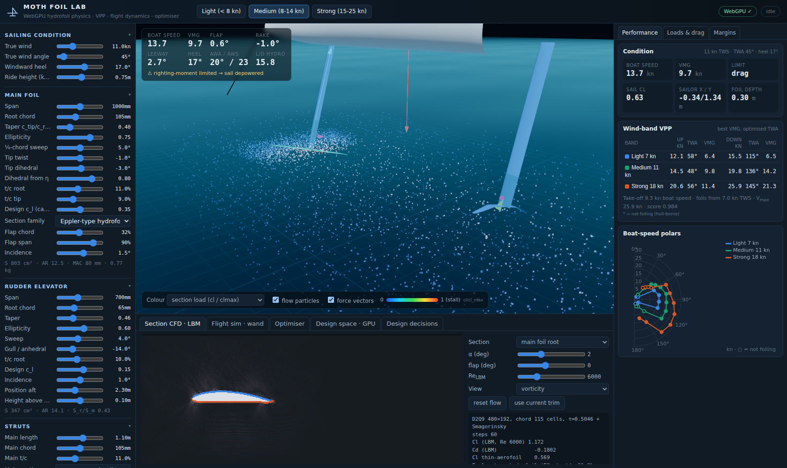
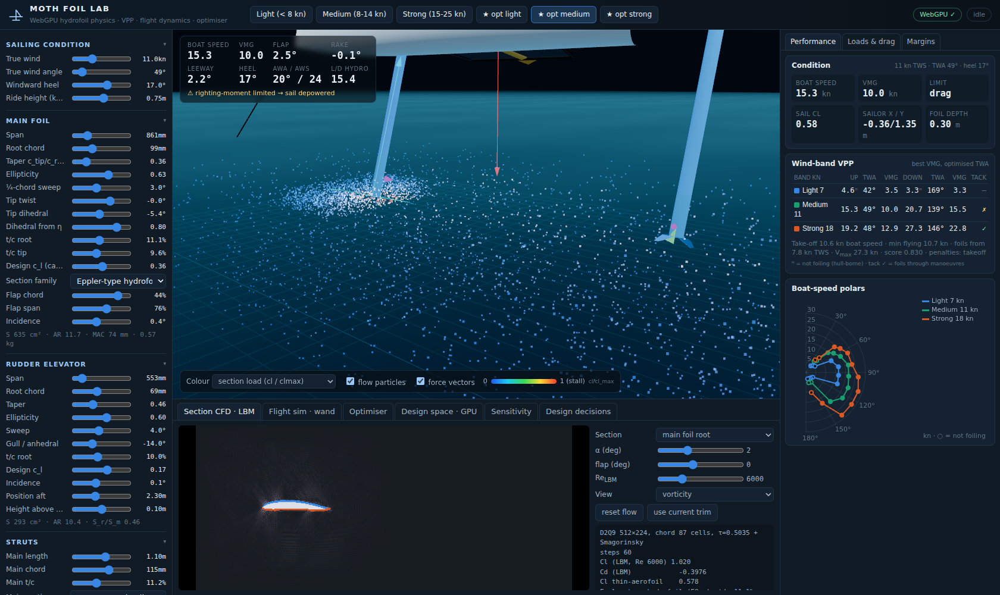
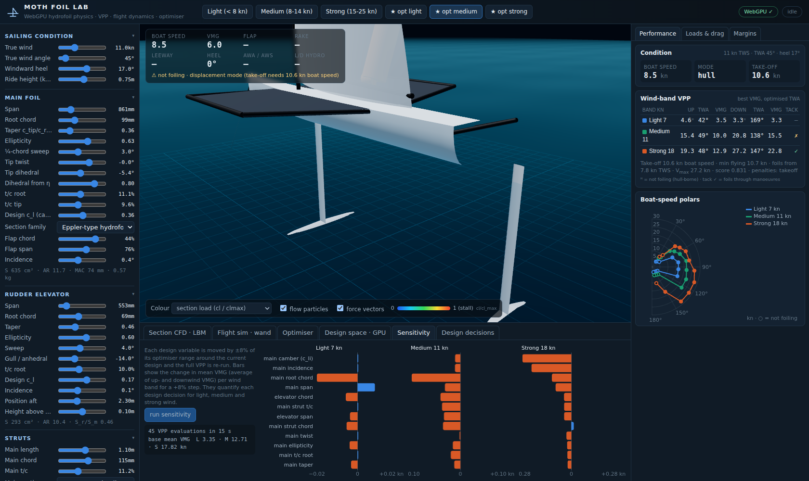
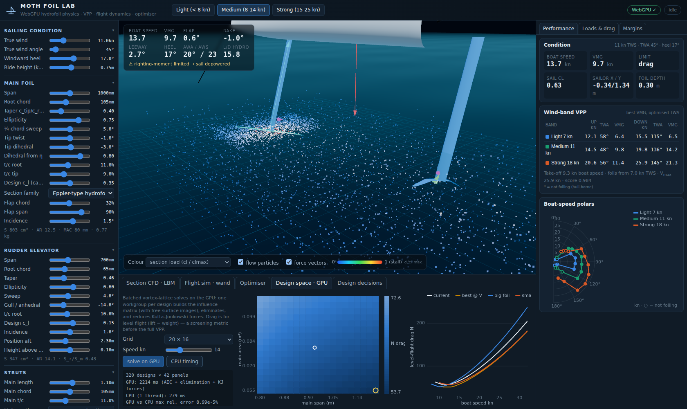
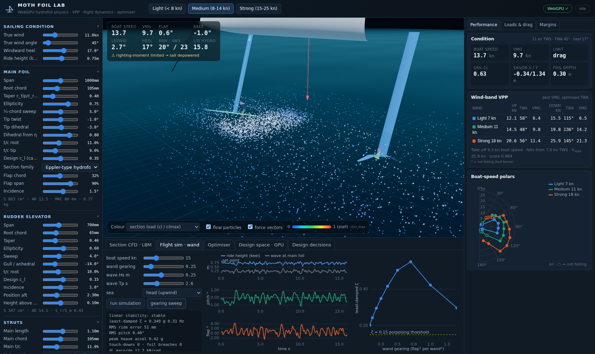
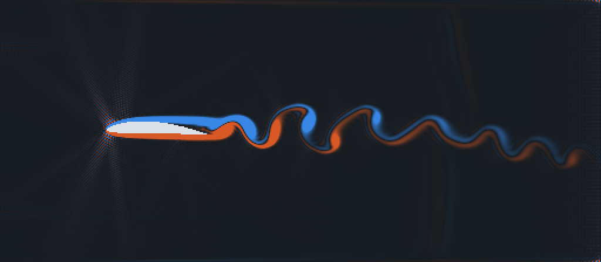
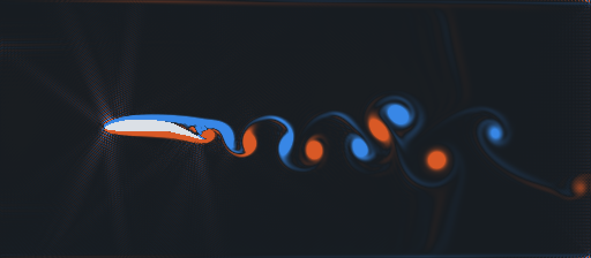
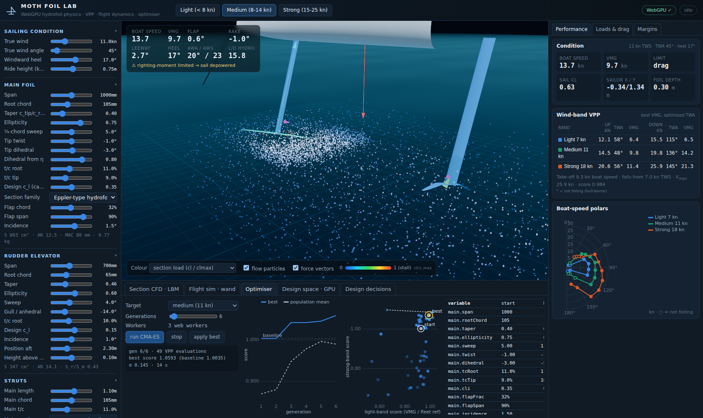
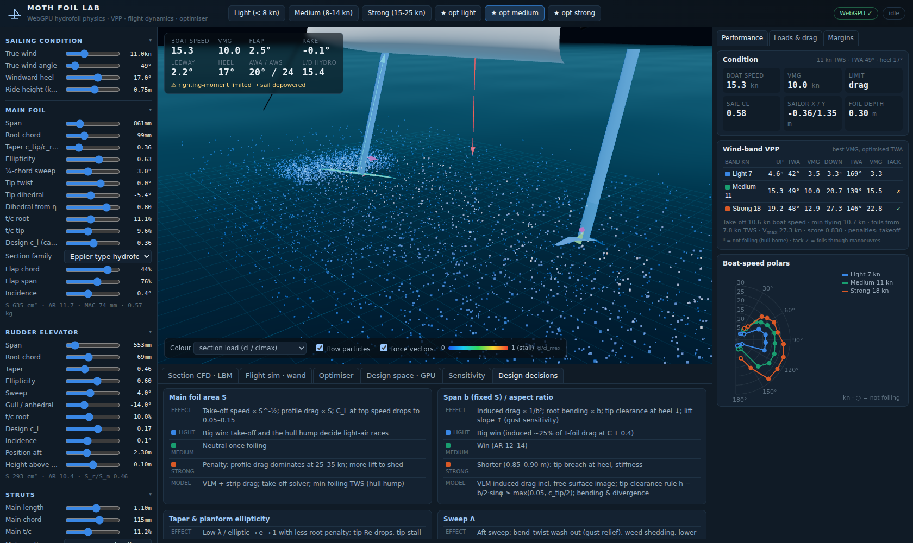

# Moth Foil Lab

A WebGPU / Three.js engineering lab for designing and optimising **International Moth** hydrofoils:
the main T-foil, the rudder elevator and both surface-piercing struts. It covers light, medium and strong wind.



```
npm install
npm run dev        # http://127.0.0.1:5173  (Chrome/Edge with WebGPU; falls back to WebGL2 without GPU compute)
npm test           # physics unit + validation tests (node --test)
node tools/optimise.mjs medium 40 12    # offline CMA-ES study -> docs/results/opt-medium.json
node tools/shape-tournament.mjs 14 10  # nature-inspired planform tournament -> docs/results/shape-tournament.json
```

## What is in it

| Module | What it does |
|---|---|
| `src/physics/vlm.js` | Vortex-lattice (Weissinger) solver for **main foil + elevator + both struts in one system**. Captures main-foil downwash on the elevator and strut/foil interference. Includes the high-Froude **free-surface image** (φ = 0 on z = 0). Linear basis: incidence, pitch, flap, elevator rake, leeway. |
| `src/physics/sections.js` | Section families (NACA 4-digit, 63-, 66-series, Eppler hydrofoil) with laminar drag buckets, transition, flap τ(E)·η_f, stall, the −Cp_min cavitation bucket, and section geometry for lofting/CFD. |
| `src/physics/hydro.js` | Full appendage force model. Adds strip profile drag and flap-gap drag, strut **spray** (0.30·q·t², measured), Hoerner **T-junction** drag and foil **wave drag**. Checks cavitation σ + Cp_min, strut ventilation and the tip-clearance rule. |
| `src/physics/sail.js` | North Sails FLOW Moth sail polar (Bögle 2010 / Waldman), depower model, CE shift and windage. |
| `src/physics/vpp.js` | **6-DOF trim VPP.** Flap (wand) carries the weight, leeway balances side force, and elevator rake plus sailor fore/aft balance pitch. Hiking balances roll and the sail depowers beyond max righting moment. Drive = drag sets speed. Also computes take-off speed, the hull-borne hump (Beaver & Zseleczky tank fit), minimum foiling wind, and best VMG with optimised TWA per wind band. |
| `src/physics/dynamics.js` | Heave/pitch **flight simulation** with wand kinematics (ψ = acos h/L), gearing, flap lag and downwash lag. Adds irregular Pierson-Moskowitz seas, orbital velocities, depth loss/ventilation, main-foil stall (with a tubercle plateau), bend–twist gust alleviation, hull touch-down and **linear eigen-stability**. |
| `src/physics/geometry.js`, `shapes.js` | Generalised planform: 3-D spanwise paths per half-wing (gull/polyhedral, crescent and raked tips, winglets, splayed feather tips, tubercled leading edge, riblets), shared by the lattice, the drag model, the structure and the 3-D loft. Shape library of 12 nature-inspired families. |
| `src/physics/structure.js` | Solid-carbon beam bending of foils and struts (tip deflection, stress) and torsional divergence speed. |
| `src/physics/optimizer.js`, `objective.js` | sep-CMA-ES over 22 design variables. The objective is VMG across wind bands normalised to fleet speeds, with research-based constraints: take-off, cavitation, divergence, deflection, strut stiffness, tip Re, S_r/S_m, ventilation, tip clearance and damping. |
| `src/gpu/lbm.js` | **WebGPU D2Q9 lattice-Boltzmann** (BGK + Smagorinsky) section CFD with the flap deflected. Momentum-exchange lift/drag is reduced on the GPU and rendered straight from GPU buffers. |
| `src/gpu/sweep.js` | **Batched vortex-lattice on WebGPU.** One workgroup per design builds the influence matrix (with images), eliminates, and reduces Kutta–Joukowski forces. Used for span × area design-space maps. Verified against the CPU solver. |
| `src/render/flowField.js` | **TSL compute** tracer particles advected through the Biot–Savart velocity field of the solved lattice (tip vortices, downwash, elevator in the wake). |
| `src/render/scene.js` | Three.js `WebGPURenderer` scene. Foils are lofted from the actual sections, with twist, dihedral and the deflected flap, and coloured by section load, cavitation margin or suction peak. |

Research behind every number: [`docs/research/MOTH_FOIL_RESEARCH.md`](docs/research/MOTH_FOIL_RESEARCH.md).
Engineering conclusions and optimised designs: [`docs/DESIGN_REPORT.md`](docs/DESIGN_REPORT.md).
Nature-inspired planforms (tuna lunate, swift rake, albatross, gull, humpback tubercles, raptor feather tips, winglets, dolphin, manta, shark-skin riblets, forward sweep): evidence in [`docs/research/BIOINSPIRED_FOILS.md`](docs/research/BIOINSPIRED_FOILS.md), tournament results in [`docs/SHAPE_STUDY.md`](docs/SHAPE_STUDY.md).

## Validation

| Check | Target (source) | Model |
|---|---|---|
| T-foil drag, 20 ft/s, 18 in, 801 N lift | 43.3 N total; 11.3 induced; 18.1 foil+junction (Beaver & Zseleczky 2009 tow tank) | within 20% / 35% / 30% (test) |
| Elliptic wing lift slope / span efficiency | Helmbold, e = 1 | < 3%, e 0.95–1.06 |
| Take-off boat speed | 7–10 kn | 7.5 / 9.3 / 12.9 kn (light/medium/strong presets) |
| Minimum foiling wind | 6–8 kn | 6.9–8.8 kn |
| Medium foil speeds, 11 kn TWS | 14–18 up / 19–25 down | 14.4 / 19.9 kn |
| Strong wind, 18 kn TWS | 17–21 up / 25–33 down | 20.6 / 25.9 kn |
| Section drag at Re 6e5 | 0.0075–0.012 | ~0.010 |
| LBM NACA 0012, Re 1000 | Cd ≈ 0.12–0.13, Cl(4°) ≈ 0.15–0.25 | 0.150 (blockage), 0.24 |
| GPU vs CPU lattice | identical | 9e-7 relative |

## Screenshots

`node tools/screenshot.mjs <url> <out.png> <main|sim|sweep|opt|sens|decisions>` drives headless Chromium
with SwiftShader WebGPU. URL options: `?preset=opt-medium`, `?tab=sweep`, `?cam=x,y,z,tx,ty,tz`.

| | |
|---|---|
|  Optimised medium foil at 11 kn TWS, TWA 49°: 15.3 kn, flap +2.5°. The GPU tracer particles show the downwash sheet and tip vortices. |  Sensitivity of mean VMG to every design variable, per wind band. |
|  Batched VLM on the GPU: level-flight drag over span × area, and drag vs speed for big and small foils. |  Heave/pitch flight sim in head seas; damping vs wand gearing. |
|  LBM section CFD, Eppler-type 12%, α 3°, flap 0°: attached flow. |  The same section with the 35% flap at +12°: separation over the hinge and a von Kármán street. |
|  In-browser CMA-ES across web workers. |  Design-decision matrix (light / medium / strong). |
