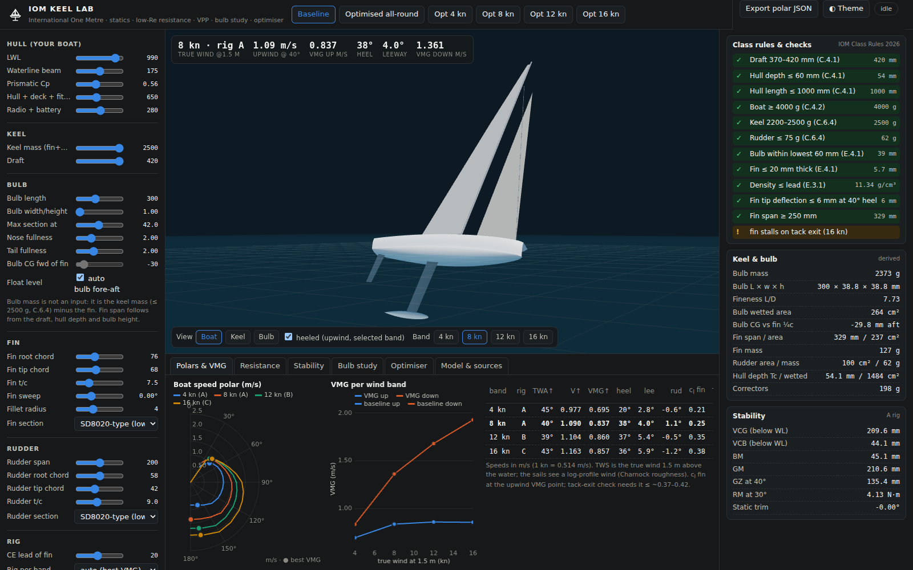
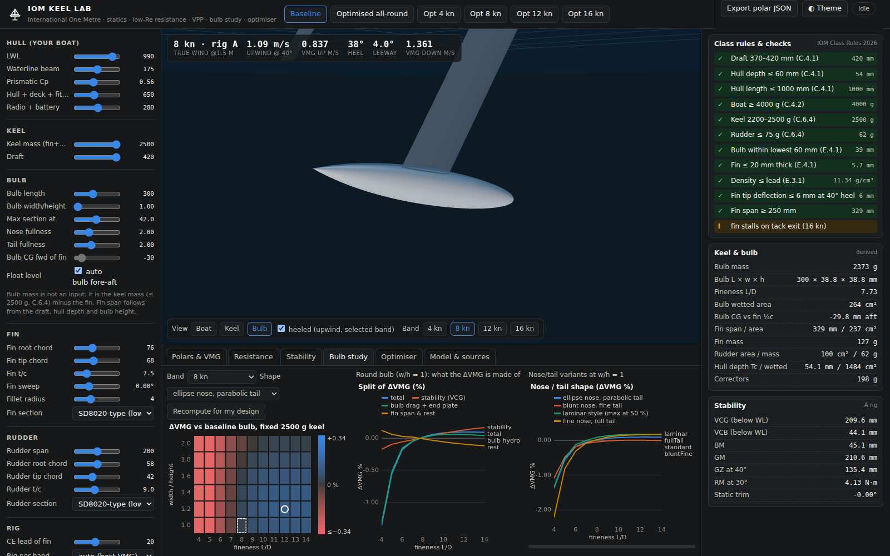
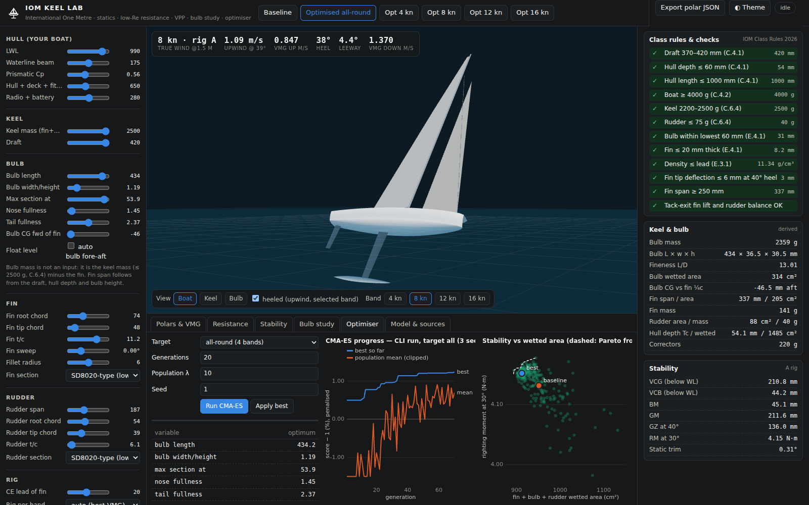
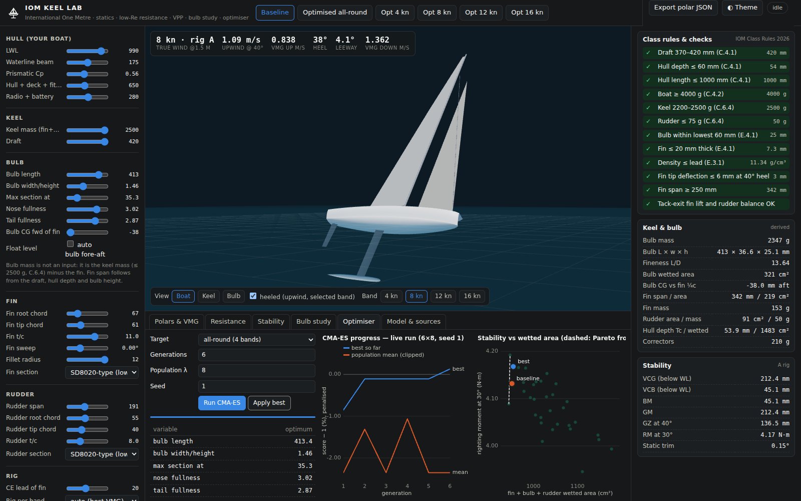
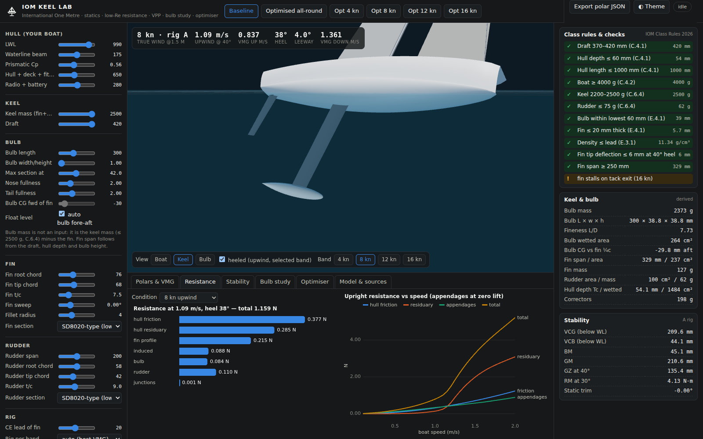
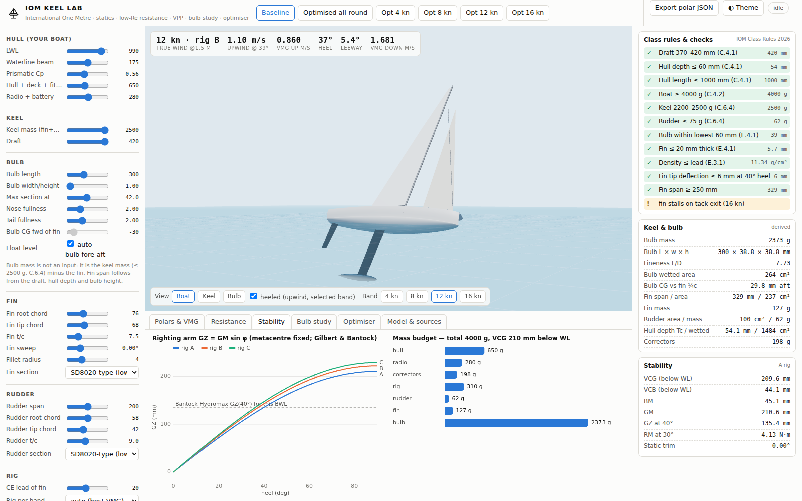
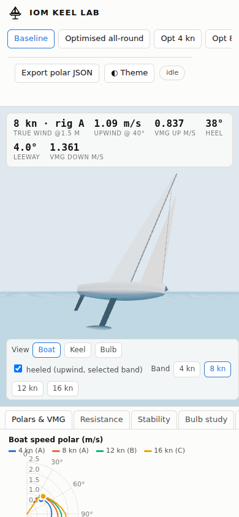

# IOM Keel Lab — design and optimisation of an International One Metre

*Page: `iom.html` (`npx vite`, then `/iom.html`). Physics: `src/iom/physics/*` (DOM-free, node-testable).
Research and sources: [`docs/research/IOM_RESEARCH.md`](research/IOM_RESEARCH.md). Results: `docs/results/iom/`.*

```
node tools/iom-validate.mjs                 # calibration + validation report  -> docs/results/iom/validation.json
node tools/iom-bulb-study.mjs               # study (a) bulb shape             -> bulb-study.json   (~45 s)
node tools/iom-optimise.mjs 30 12 3         # study (b) CMA-ES per band + all  -> opt-*.json        (~9 min)
node tools/iom-sensitivity.mjs --reopt      # study (c) uncertain inputs       -> sensitivity.json  (~4 min)
node tools/iom-fit-delft.mjs                # own Delft-series regression      -> src/iom/physics/delftFit.js
node tools/iom-screenshot.mjs http://127.0.0.1:5181   # docs/screenshots/30-iom-*.png (dev server on 5181)
```



## 0. Short answer for the builder

* **Bulb shape is worth less than you might hope — once the bulb is slender.** At a fixed 2500 g keel, going from a
  fat bulb (L/D 6, ~250 mm) to a slender one (L/D 10, ~355 mm) gains **+0.6 % VMG in 4 kn** and **+0.2–0.3 % in 8–16 kn**;
  a very fat L/D 4 bulb costs 1.6–3.6 % upwind. From L/D ≈ 9 to 14 the curve is flat within ±0.05 %. This agrees with the
  Gilbert & Bantock tow tests (which the drag model is calibrated on) and with the class's move to L/D ≈ 10 since 1998.
* **Flattening (width > height) does not pay** in the model: w/h 2 lowers the VCG by only ~3 mm (+1.2 % righting moment)
  but adds ~9 % bulb wetted area: +0.02–0.09 % upwind in 8–16 kn, −0.2 to −0.3 % downwind and −0.4 % in light air.
  (Bantock's 2003 oval bulb: "about as good on the beat, not quite as good on the run".) Keep w/h ≤ 1.2.
* **Nose/tail shape: +0.1 %.** A "laminar-style" body — maximum section at ~50 % of the length, fine elliptic-power nose,
  tail fullness ~2.4 — is +0.06–0.15 % better than an ellipse/parabola body with the maximum at 42 %; a blunt nose with a
  fine tail is slightly worse. This depends on the unknown transition behaviour of the bulb (§6).
* **The all-round optimum is worth ≈ +1.2 % mean VMG** over a typical DIY keel. Split: bulb shape +0.26 %, floating
  ~0.3° stern-down (bulb 15 mm aft of level trim) +0.46 % (from a crude trim/nosedive model — test before trusting it),
  rudder 12 % smaller and thinner +0.31 %, tapered thicker fin +0.18 %.
* **What to build (all-round):** a 2360 g lead bulb ~390–430 mm long, ~31 mm tall × 36 mm wide (w/h ≈ 1.2),
  maximum section at 52–54 %, fine nose, moderately full tail; a fin tapered 74 → 48 mm at 11 % thickness (SD8020-like
  low-Re section), 5–6 mm root/tip fillets; rudder ~187 mm × 54/39 mm at 6–7 % (≈ 88 cm², 40 g). Details and caveats in §7.

## 1. What is modelled

### 1.1 Rules as hard limits (IOM Class Rules 2026)

Draft ≤ 420 mm (the fin span follows from it), hull depth ≤ 60 mm, boat ≥ 4000 g, **keel (fin + bulb) 2200–2500 g**,
rudder ≤ 75 g, keel ≤ 20 mm wide except the lowest 60 mm (**so the bulb must be ≤ 60 mm tall**, but may be as wide as you
like), appendage density ≤ lead. The bulb mass is therefore not free: it is 2500 g minus the fin. Whatever the hull, radio
and rig do not use up to 4000 g goes into correctors inside the hull.

### 1.2 Statics (`statics.js`, `geometry.js`)

* Bulb: sections are ellipses of height h·ρ(ξ) and width w·ρ(ξ), w = (w/h)·h. The profile ρ has an elliptic-power nose
  ρ = (1 − (1 − ξ/x_m)^p)^(1/p) and a power tail ρ = 1 − t^q. Given the lead mass, V = m/11 340 and
  h = √(4V / (π (w/h) L ∫ρ²dξ)). Wetted area integrates the Ramanujan perimeter along the meridian. Bulb CG sits h/2 above
  the lowest point (draft).
* Fin span b = draft − T_c − 0.95 h (fixed point with the fin mass, which comes out of the 2500 g).
* Canoe body: T_c = ∇_c/(C_p C_m L B) with ∇_c = Δ/ρ − appendage volumes; wetted area from the Delft regression
  S_c = (1.97 + 0.171 B/T)(0.65/C_m)^(1/3)(∇L)^(1/2); KB by Morrish; I_T = C_IT L B³ with the PNA
  C_IT = 0.1216 C_wp − 0.041 × **0.77** (fitted to Bantock's Hydromax results, §3).
* **GZ(φ) = GM sin φ, M fixed** (Gilbert & Bantock). The bulb fore-aft position floats the boat level by default.

### 1.3 Resistance (`resistance.js`, `foils.js`)

| Component | Model |
|---|---|
| Hull friction | ITTC-57 with a laminar forebody: C_f = C_fT(Re) − (Re_tr/Re)(C_fT(Re_tr) − 1.328/√Re_tr), Re on 0.7 LWL, **Re_tr = 2·10⁵ (uncertain, 1e5–1e6 studied)**, 1+k = 1.08 |
| Hull residuary | ORC residuary surfaces R_r/W(Fn, L/∇^(1/3), B/T) (Delft-series based; the IOM lies inside the grid). Alternatives: +9 % (Laser tank vs Delft, Day & Nixon 2014) and an own regression of the Delft Series 1 data |
| Heel, trim | R_r × (1 + 0.15 (φ/30°)²); bow-down dynamic trim θ = drive·(z_CE + 0.06)/(Δ g BM_L) costs 3 %·θ²(deg) of R_r, and the skipper depowers to keep total bow-down trim ≤ 3.5° (nosedive) |
| Fin, rudder profile | UIUC SD8020 polars at Re 6·10⁴–3·10⁵ (measured, bubble drag included), Hoerner thickness factor, family factors for NACA 00xx (+8 % at low Re) and NACA 63 (+25 % at Re ≤ 1e5, −10 % above 4e5); stall above c_l,max ≈ 0.67–0.83 |
| Bulb | q S C_f(Re_L, x_tr)·[1 + 1.5(D/L)^1.5 + 7(D/L)³] + q A_f K (s/0.1)² / (1 + (Re_L/1.5·10⁵)^2.5) — transitional friction, Hoerner body form factor, and a low-Re afterbody-separation term (s = tail closing slope). K = 0.04 is **calibrated** on the Gilbert & Bantock bulb tow tests (§3) |
| Junctions | Hoerner wall junction ΔC_D(t²) = 0.75 t/c − 0.0003/(t/c)², −60 % with a fillet ≥ t |
| Induced | Munk two-lifting-line formula for fin (+bulb end plate, span × √(1 + 0.5 w/b)) and rudder with the hull as mirror plane, e = 0.95(1 − 0.25 sin φ); slender-body hull side force π q T_c² β |

### 1.4 Sails and wind (`sails.js`)

Rig areas from the rule sail dimensions: **A 0.60, B 0.42, C 0.28 m²**; CE 40 % up each luff (A: 0.72 m above the WL; Gilbert
used 0.74 m). Combined main + jib coefficients have the Hazen/ORC shape re-scaled to the Southampton IOM A-rig tunnel tests
(C_l ≈ 1.3, C_d ≈ 0.25 at AWA 30°; C_d ≈ 0.45 at 70°; C_d rises 0.22 per unit C_l at 40°). C_D = C_D0(β) + K C_L² with
K = 0.11 for A, scaled by aspect ratio for B and C. "Flat" (0.3–1) depowers. Forces use the apparent wind in the heeled
plane. Windage: mast 0.011 m²/m, hull and fittings 0.01 m² + 0.035 sin²(AWA). The quoted true wind (TWS) is at **1.5 m**;
the sails see the log profile U = u*/κ ln(z/z₀) with Charnock z₀, averaged over the sail height.

### 1.5 VPP (`vpp.js`)

For each heading: the largest boat speed V at which drive ≥ resistance, with (i) heel from RM(φ) = F_heel (z_CE + z_CLR),
(ii) leeway and rudder angle from the side-force and yaw balance (drive offset to leeward and keel drag offset to windward
give weather helm; CE is 20 mm ahead of the fin), (iii) flat chosen to maximise excess thrust, capped by maxHeel = 40°
("use a rig until you see your rudder") and the nosedive trim. VMG by golden-section search over TWA; the rig per band is the
best of A/B/C by mean VMG. Bands: **4, 8, 12, 16 kn at 1.5 m**.

### 1.6 Optimiser (`objective.js`, `optimise.js`)

sep-CMA-ES (the Moth lab's) over 13 variables: bulb length, w/h, max-section position, nose and tail fullness, fore-aft
offset (±15 mm about level trim); fin root chord, taper, t/c, section family, fillet; rudder area scale and t/c. Hull, keel
mass (2500 g) and draft (420 mm) are fixed. Objective: mean over bands of ½(VMG_up/VMG_up,base + VMG_down/VMG_down,base),
rigs per band fixed to the baseline choice. Hard limits (penalties): bulb ≤ 60 mm tall, rudder ≤ 75 g, draft, fin tip
deflection ≤ 6 mm at 40° heel (solid carbon, E = 70 GPa), fin span ≥ 250 mm, **fin c_l at 75 % of upwind speed ≤ c_l,max
(tack exit, after Robinson)**, rudder c_l ≤ 0.45 for balance, rudder ≥ 85 cm² (the steady VPP cannot value manoeuvring).

## 2. Baseline (a typical DIY IOM)

LWL 990, BWL 175, C_p 0.56, hull + deck + fittings 650 g, radio 280 g, rigs 310 g; keel 2500 g = fin 127 g (76→68 mm chord,
7.5 % SD8020-type) + bulb 2373 g (300 mm, round, L/D 7.7, 38.8 mm Ø, 264 cm²); rudder 200 mm × 58→42 mm, 62 g; 198 g of
correctors. VCG 210 mm below the WL, GM 211 mm, **GZ(40°) = 135 mm**, RM(30°) = 4.1 N·m.

| TWS at 1.5 m | Rig | Upwind V (m/s) @ TWA | VMG up | heel / leeway | Downwind V @ TWA | VMG down |
|---|---|---|---|---|---|---|
| 4 kn | A | 0.98 @ 45° | 0.695 | 20° / 2.8° | 0.87 @ 163° | 0.835 |
| 8 kn | A | 1.09 @ 40° | 0.837 | 38° / 4.0° | 1.36 @ 180° | 1.361 |
| 12 kn | B | 1.10 @ 39° | 0.860 | 37° / 5.4° | 1.71 @ 170° | 1.681 |
| 16 kn | C | 1.16 @ 43° | 0.857 | 36° / 5.9° | 1.96 @ 169° | 1.929 |

The VPP changes rig at ≈ 10.5 kn (A→B) and ≈ 14.5 kn (B→C) by mean VMG (upwind alone prefers B from 8 kn). IOM skippers
quote A to ~15 kn and B to ~23 kn (Barrow), at an unstated height and usually with gusts in mind; Gilbert's tunnel note puts
the top of the A range much lower. Treat the crossover as model-dependent (it moves with maxHeel and the nosedive limit, §5).

## 3. Validation

| Check | Source value | Model | Status |
|---|---|---|---|
| Bulb tow tests, 250→300→350 mm bulbs, constant tow force (Gilbert & Bantock, MY #184) | +1.4 / +1.9 % at 0.5 m/s; +0.6 / ~+0.6 % at 1.0 m/s | +1.53 / +2.01 %; +0.65 / +0.75 % (rms error 0.11 %-pts) | **calibration**: K, Re_s and n fitted on a 120-point grid to these 4 numbers, so this is a fit, not a validation. Without the separation term the model predicts ±0.1 % — friction plus Hoerner form factor cannot explain the measured trend |
| Extra fin wetted area, +2.3 % of total (RG65 tow tests, MY #183), Froude-scaled to the IOM | −4.7 / −3.8 / −0.7 % | −0.8 / −0.6 / 0.0 % | **not reproduced.** A 2.3 % area increase can cost at most ~1.2 % speed if all drag were friction; the measured effect is 4× that. Unexplained (test scatter, or flow change on the deeper fin) |
| GZ(40°) vs waterline beam (Bantock, Hydromax) | 115 mm at 135 mm BWL, +0.50 mm/mm | 117 mm, +0.56 mm/mm (135–215 mm BWL within 7 mm) | C_IT fitted (×0.77); the slope is then a check |
| Named designs GZ(40°) (Gilbert & Bantock MY #173) | 117–158 mm | 135 mm for BWL 175 mm | consistent |
| Canoe-body wetted area (Bantock) | practical minimum ≈ 0.142 m² at BWL 160 | 0.141 m² at BWL 155, 0.148 at 175 | consistent |
| A rig in the tunnel, 4.3 m/s apparent, AWA 30° (Southampton) | drive 2.5–3.5 N, heel ≤ 10 N | 2.53 N, 8.5 N | coefficients scaled to these points |
| A rig, beam reach | drive ≈ 10 N | 9.6 N | consistent |
| Upwind speed, A rig, 8 kn at 1.5 m | hull speed 1.23–1.25 m/s (Gilbert); Marblehead timed 1.45 m/s ≈ 1.28 m/s Froude-scaled | 1.09 m/s at 38° heel (1.10–1.16 m/s in 12–16 kn) | plausible, below hull speed |
| Beam-reach speed at the top of Gilbert's A range (2.5 m/s ≈ 5 kn) | 1.17 m/s (his scaled spreadsheet, not a measurement) | 1.20 m/s at 4 kn, 1.50 m/s at 8 kn | consistent at 4–5 kn |
| Upwind leeway | full-size practice ~3° (Robinson); no IOM data | 2.8–5.9° | plausible |
| Fin design c_l upwind | 0.2–0.3 recommended (Robinson) | 0.21–0.38 | consistent |
| Rig change winds | A to ~15 kn, B to ~23 kn (Barrow; height and gust basis not stated) | A→B 10.5 kn, B→C 14.5 kn at 1.5 m (≈ 12.7 / 17.6 kn at 10 m) | model changes down earlier; strongly dependent on max heel and the nosedive limit (§6) |

**What is not validated.** No IOM GPS or tank polar exists in the public record we could find (the radiosailingtechnology.com
IOM drag measurements are behind a Cloudflare block; only their summary — measured friction ≥ 30 % above expectation,
drag rising sharply above 1.5 kn — was visible). Downwind speeds above Fn ≈ 0.45 rest on the ORC surfaces, the trim model
and the nosedive limit, none of them IOM-specific. The bulb separation constant is a one-parameter fit to four tow-tank
numbers, so the bulb-shape conclusions are calibrated at the fineness range 6–10 and extrapolated beyond it.

## 4. Bulb shape: what matters and by how much (study a)

Fixed keel mass (2500 g), baseline hull, fin and rudder; rigs A/A/B/C. ΔVMG is the mean of up- and downwind change against
the baseline bulb (300 mm, round, L/D 7.7). Full grid in `docs/results/iom/bulb-study.json`; heat map in the page.



Mean ΔVMG over the four bands (standard ellipse/parabola profile, max section at 42 %):

| L/D \ w/h | 1.0 | 1.2 | 1.4 | 1.6 | 1.8 | 2.0 |
|---|---|---|---|---|---|---|
| 4 | −1.75 | −1.76 | −1.79 | −1.84 | −1.90 | −1.97 |
| 6 | −0.25 | −0.25 | −0.29 | −0.33 | −0.38 | −0.43 |
| 8 | +0.02 | +0.01 | −0.02 | −0.06 | −0.11 | −0.16 |
| 10 | +0.07 | +0.06 | +0.04 | −0.00 | −0.05 | −0.10 |
| 12 | +0.08 | +0.07 | +0.04 | −0.00 | −0.05 | −0.10 |
| 14 | +0.06 | +0.05 | +0.02 | −0.02 | −0.07 | −0.12 |

Per band (up / down, %):

| Change | 4 kn (A) | 8 kn (A) | 12 kn (B) | 16 kn (C) |
|---|---|---|---|---|
| L/D 6 → 10, round | +0.64 / +0.54 | +0.43 / +0.10 | +0.36 / +0.09 | +0.35 / +0.06 |
| L/D 10 → 4, round | −3.63 / −3.11 | −2.17 / −0.73 | −1.69 / −0.81 | −1.64 / −0.77 |
| w/h 1.0 → 1.6 at L/D 10 | −0.23 / −0.26 | +0.07 / −0.09 | +0.08 / −0.12 | +0.09 / −0.16 |
| w/h 1.0 → 2.0 at L/D 10 | −0.43 / −0.45 | +0.02 / −0.16 | +0.07 / −0.23 | +0.07 / −0.28 |
| laminar-style vs standard profile, L/D 10 | +0.15 / +0.12 | +0.11 / +0.05 | +0.06 / +0.08 | +0.07 / +0.11 |

**Which effect dominates** (decomposition, round bulb, change L/D 6 → 10):

| Band | total | stability (VCG 2.0 mm lower, RM +0.8 %) | bulb drag + end plate | fin span & rest |
|---|---|---|---|---|
| 4 kn | +0.59 | +0.06 | **+0.69** | −0.16 |
| 8 kn | +0.27 | **+0.13** | +0.21 | −0.08 |
| 12 kn | +0.22 | +0.11 | +0.19 | −0.08 |
| 16 kn | +0.20 | +0.12 | +0.18 | −0.10 |

* In light air the bulb's own drag dominates; above ~8 kn, where the boat is heel-limited upwind, the lower VCG of the
  slimmer bulb matters as much. The "rest" is negative because a lower bulb lengthens the fin (more wetted area).
* The drag gain comes almost entirely from the **low-Re afterbody separation term**: a fat bulb has a steep tail on which
  the laminar boundary layer separates at Re_L ≈ 2–4·10⁵. With that term switched off the L/D 6 → 10 gain is ≈ 0 (−0.08 to
  +0.06 %); doubled it is +0.4–1.3 % (§6). The term is calibrated on the only IOM bulb tow data (L/D 6–10), so L/D > 10 is an
  extrapolation — which is why the model finds the curve flat there rather than still improving.
* Flattening lowers the CG by only (h_round − h_flat)/2 ≈ 3–5 mm: the bulb is already at the bottom of a 420 mm keel, so the
  VCG of the whole boat (≈ 210 mm below the WL) moves by 1.5–3 mm. The extra perimeter costs more than that buys, except
  upwind at the top of each rig's range.
* Laminar extent: moving the maximum section aft (42 → 50 %) lengthens the laminar run to the pressure minimum; worth
  ~0.1 %, less if the bulb transitions early (turbulent water, a rough finish): with transition at Re_x = 2·10⁵ the gain in
  12–16 kn halves to +0.03–0.04 %.

## 5. Optimised designs (study b)

Three seeds per target; single-band runs 30 generations × λ 12, the all-round run 70 generations (seed 1 warm-started
from the single-band optimum that scored best all-round). Seeds agree within 0.1–0.2 %:
* all: seed 3 +1.24 %, seed 1 +1.24 %, seed 2 +1.14 %
* 4: seed 3 +2.16 %, seed 2 +2.06 %, seed 1 +2.06 %
* 8: seed 1 +1.34 %, seed 2 +1.29 %, seed 3 +1.21 %
* 12: seed 1 +1.49 %, seed 2 +1.48 %, seed 3 +1.31 %
* 16: seed 2 +1.41 %, seed 1 +1.40 %, seed 3 +1.25 %

| | Baseline | **All-round** | 4 kn | 8 kn | 12 kn | 16 kn |
|---|---|---|---|---|---|---|
| Bulb length (mm) | 300 | 434 | 360 | 423 | 386 | 314 |
| Bulb h × w (mm) | 38.8 × 38.8 | 30.5 × 36.5 | 35.1 × 37.7 | 26.7 × 40.5 | 26.1 × 42.7 | 33.3 × 42.2 |
| Fineness L/D | 7.7 | 13.0 | 9.9 | 12.9 | 11.6 | 8.4 |
| Max section at | 42 % | 54 % | 48 % | 48 % | 46 % | 50 % |
| Nose / tail fullness | 2.00 / 2.00 | 1.45 / 2.37 | 1.40 / 2.79 | 1.66 / 2.50 | 1.79 / 2.83 | 1.65 / 2.72 |
| Bulb CG vs level trim (mm, + fwd) | 0 | -15.0 | 1.2 | -13.7 | -14.7 | -14.5 |
| Bulb mass (g) / wetted (cm²) | 2373 / 264 | 2359 / 314 | 2410 / 289 | 2401 / 325 | 2388 / 316 | 2355 / 272 |
| Fin root → tip chord (mm) | 76 → 68 | 74 → 48 | 61 → 35 | 65 → 37 | 77 → 43 | 77 → 43 |
| Fin t/c, section | 7.5 %, sd8020 | 11.2 %, sd8020 | 11.6 %, sd8020 | 11.0 %, sd8020 | 8.9 %, sd8020 | 11.9 %, sd8020 |
| Fin span (mm) / area (cm²) / mass (g) | 329 / 237 / 127 | 337 / 205 / 141 | 332 / 159 / 90 | 340 / 173 / 99 | 341 / 205 / 112 | 334 / 200 / 145 |
| Fillet radius (mm) | 4.0 | 5.7 | 8.0 | 8.7 | 7.6 | 2.4 |
| Rudder span × root/tip (mm) | 200 × 58/42 | 187 × 54/39 | 185 × 54/39 | 185 × 54/39 | 186 × 54/39 | 187 × 54/39 |
| Rudder area (cm²), t/c | 100, 9.0 % | 88, 6.1 % | 85, 7.0 % | 86, 6.0 % | 86, 6.6 % | 87, 7.5 % |
| VCG (mm below WL) / GZ40 (mm) | 209.6 / 135.4 | 210.8 / 136.0 | 211.8 / 137.5 | 214.0 / 138.6 | 213.5 / 138.1 | 209.7 / 135.3 |
| ΔVMG up / down 4 kn | +0.0 % / +0.0 % | +1.4 % / +0.9 % | +2.8 % / +1.5 % | +2.5 % / +1.3 % | +1.7 % / +0.9 % | +0.9 % / +0.4 % |
| ΔVMG up / down 8 kn | +0.0 % / +0.0 % | +1.2 % / +0.6 % | +2.0 % / +0.1 % | +2.1 % / +0.5 % | +1.7 % / +0.6 % | +0.9 % / +0.5 % |
| ΔVMG up / down 12 kn | +0.0 % / +0.0 % | +0.9 % / +1.7 % | +1.5 % / +0.1 % | +1.8 % / +1.3 % | +1.5 % / +1.5 % | +0.7 % / +1.5 % |
| ΔVMG up / down 16 kn | +0.0 % / +0.0 % | +1.1 % / +1.9 % | +1.6 % / +0.4 % | +1.8 % / +1.8 % | +1.7 % / +1.9 % | +1.0 % / +1.8 % |
| **Mean ΔVMG, 4 bands** | **+0.00 %** | **+1.22 %** | **+1.25 %** | **+1.65 %** | **+1.43 %** | **+0.95 %** |
| Constraint violations (all bands) | fin stalls on tack exit (16 kn) | none | fin stalls on tack exit (12 kn); fin stalls on tack exit (16 kn) | fin stalls on tack exit (12 kn); fin stalls on tack exit (16 kn) | fin stalls on tack exit (16 kn) | none |

**Attribution** — each part of an optimum applied alone to the baseline (mean ΔVMG over the four bands):

| Optimum | bulb shape only (level trim) | bulb fore-aft (trim) only | fin only | rudder only | all together |
|---|---|---|---|---|---|
| all-round | +0.26 % | +0.46 % | +0.18 % | +0.31 % | +1.22 % |
| 4 kn | +0.18 % | -0.04 % | +0.77 % | +0.32 % | +1.25 % |
| 8 kn | +0.11 % | +0.42 % | +0.73 % | +0.34 % | +1.65 % |
| 12 kn | +0.04 % | +0.45 % | +0.59 % | +0.32 % | +1.43 % |
| 16 kn | +0.07 % | +0.45 % | +0.16 % | +0.28 % | +0.95 % |

What the optimiser does, and why:

* **Bulb:** always long (L/D 8.4–13), round or nearly so (w/h 1.07–1.5), maximum section moved aft to 46–54 %, fine nose.
  The length within L/D 10–13 is a plateau: the 20-generation re-optimisations of §6 land at 357–390 mm for the same score.
* **Fore-aft:** in every band except 4 kn it pushes the bulb to the 15 mm-aft limit, i.e. ~0.3° static stern-down trim
  that pre-compensates the bow-down pitching moment of the rig downwind (nosedive limit). This is the least trustworthy
  result: it rests on the assumed 3 %/deg² trim penalty and the 3.5° nosedive threshold (with a 2.5° threshold the optimum's
  gain rises to +2.9 %). Test it with correctors, do not move the fin box for it.
* **Fin:** less area (159–205 cm² vs 237) but thicker (11–12 %) and strongly tapered. Thickness is bought for c_l,max:
  the tack-exit constraint (fin c_l at 75 % speed ≤ c_l,max) is active in 12–16 kn, and the low-Re c_l,max rises with
  thickness in the model. The light-air optima (4 and 8 kn) have small fins that stall on tack exit in 12–16 kn — a
  light-air keel only (one keel per event, C.6.2).
* **Rudder:** shrinks to the 85 cm² floor and 6–7 % thickness. The floor is a judgement (manoeuvring and gust response
  are not in a steady VPP); the gain is real only if the smaller rudder still controls the boat.
* **Pareto trade-off (righting moment vs appendage wetted area):** the feasible designs span RM(30°) ≈ 4.0–4.2 N·m against
  ≈ 900–1150 cm² of fin + bulb + rudder wetted area (page, Optimiser tab). The optimum sits on the front at high RM *and*
  low area: a long thin bulb lowers the CG and a smaller, thicker fin cuts area; there is no real conflict until the fin
  reaches the tack-exit limit.

## 6. Sensitivity to the uncertain inputs (study c)

Each row changes one input; columns: baseline VMG up, bulb conclusions per band (4/8/12/16 kn), the all-round optimum
re-evaluated, and (for five inputs) a 20-generation re-optimisation warm-started from the optimum.

| Input | rigs | VMG up 4/8/12/16 (m/s) | L/D 10 vs 6 (mean of up/down, per band) | w/h 1.6 vs 1.0 | laminar tail vs standard | optimum gain (re-evaluated) | re-optimised |
|---|---|---|---|---|---|---|---|
| default | AABC | 0.695 / 0.837 / 0.860 / 0.857 | +0.59 % +0.26 % +0.22 % +0.21 % | -0.24 % -0.01 % -0.02 % -0.03 % | +0.14 % +0.08 % +0.07 % +0.09 % | +1.23 % | +1.19 % |
| hull transition Re 1e5 | AABC | 0.678 / 0.827 / 0.852 / 0.848 | +0.60 % +0.29 % +0.23 % +0.21 % | -0.24 % -0.02 % -0.02 % -0.03 % | +0.13 % +0.06 % +0.07 % +0.09 % | +1.20 % (violates) |  |
| hull transition Re 5e5 | AABC | 0.743 / 0.866 / 0.884 / 0.880 | +0.54 % +0.25 % +0.22 % +0.21 % | -0.27 % -0.03 % -0.03 % -0.04 % | +0.13 % +0.07 % +0.08 % +0.09 % | +1.22 % (violates) |  |
| hull transition Re 1e6 | AABC | 0.760 / 0.881 / 0.899 / 0.895 | +0.56 % +0.26 % +0.23 % +0.19 % | -0.29 % -0.04 % -0.04 % -0.05 % | +0.15 % +0.07 % +0.09 % +0.10 % | +1.25 % (violates) | +1.14 % |
| bulb transition Re 2e5 | AABC | 0.695 / 0.837 / 0.860 / 0.857 | +0.59 % +0.26 % +0.22 % +0.17 % | -0.24 % -0.01 % -0.02 % -0.03 % | +0.14 % +0.08 % +0.04 % +0.03 % | +1.10 % |  |
| bulb transition Re 1e6 | AABC | 0.695 / 0.837 / 0.860 / 0.857 | +0.59 % +0.26 % +0.22 % +0.21 % | -0.24 % -0.01 % -0.02 % -0.03 % | +0.14 % +0.08 % +0.07 % +0.09 % | +1.24 % |  |
| residuary ORC +9 % | AABC | 0.691 / 0.832 / 0.856 / 0.851 | +0.58 % +0.29 % +0.22 % +0.20 % | -0.24 % -0.01 % -0.01 % -0.03 % | +0.13 % +0.07 % +0.07 % +0.08 % | +1.17 % (violates) |  |
| residuary own Delft fit | AABC | 0.686 / 0.821 / 0.848 / 0.850 | +0.57 % +0.27 % +0.24 % +0.22 % | -0.23 % +0.00 % -0.01 % -0.03 % | +0.13 % +0.07 % +0.07 % +0.08 % | +1.23 % | +1.15 % |
| bulb separation off | AABC | 0.697 / 0.838 / 0.861 / 0.858 | -0.08 % +0.06 % +0.04 % +0.03 % | -0.24 % -0.01 % -0.02 % -0.03 % | +0.14 % +0.08 % +0.07 % +0.09 % | +1.12 % | +1.10 % |
| bulb separation x2 | AABC | 0.693 / 0.836 / 0.859 / 0.856 | +1.26 % +0.54 % +0.41 % +0.39 % | -0.24 % -0.01 % -0.02 % -0.03 % | +0.13 % +0.08 % +0.07 % +0.09 % | +1.33 % |  |
| heel resistance 0 | AABC | 0.698 / 0.849 / 0.872 / 0.870 | +0.59 % +0.26 % +0.24 % +0.23 % | -0.25 % -0.02 % -0.02 % -0.03 % | +0.14 % +0.07 % +0.08 % +0.09 % | +1.23 % (violates) |  |
| heel resistance 0.3 | AABC | 0.692 / 0.826 / 0.852 / 0.847 | +0.59 % +0.29 % +0.25 % +0.21 % | -0.24 % -0.01 % -0.02 % -0.03 % | +0.13 % +0.06 % +0.07 % +0.08 % | +1.20 % (violates) |  |
| max heel 35° | AABC | 0.695 / 0.834 / 0.858 / 0.856 | +0.59 % +0.33 % +0.26 % +0.21 % | -0.24 % -0.02 % -0.02 % -0.03 % | +0.14 % +0.06 % +0.07 % +0.09 % | +1.23 % |  |
| max heel 50° | AABC | 0.695 / 0.837 / 0.860 / 0.857 | +0.59 % +0.26 % +0.22 % +0.21 % | -0.24 % -0.01 % -0.02 % -0.03 % | +0.14 % +0.08 % +0.07 % +0.09 % | +1.23 % | +1.15 % |
| nosedive trim 2.5° | AABC | 0.695 / 0.837 / 0.860 / 0.857 | +0.59 % +0.26 % +0.25 % +0.24 % | -0.24 % -0.01 % -0.04 % -0.05 % | +0.14 % +0.08 % +0.08 % +0.10 % | +2.86 % |  |
| nosedive trim 5° | AAAB | 0.695 / 0.837 / 0.757 / 0.792 | +0.59 % +0.26 % +0.34 % +0.25 % | -0.24 % -0.01 % +0.05 % -0.00 % | +0.14 % +0.08 % +0.10 % +0.10 % | +1.90 % (violates) |  |
| hull 850 g (heavy DIY) | AABC | 0.693 / 0.833 / 0.857 / 0.853 | +0.59 % +0.33 % +0.23 % +0.21 % | -0.24 % -0.01 % -0.02 % -0.03 % | +0.14 % +0.07 % +0.07 % +0.09 % | +1.19 % |  |

Re-optimised variables (20 generations):

* default: bulb length 386.541, bulb width/height 1.194, max section at 53.41, nose fullness 1.752, tail fullness 2.362, bulb fwd of level trim -14.645, fin root chord 78.35, fin taper 0.575, fin t/c 11.25, fin section 0.69, fillet radius 5.815, rudder area scale 0.856, rudder t/c 6.631
* hull transition Re 1e6: bulb length 389.791, bulb width/height 1.143, max section at 52.967, nose fullness 1.641, tail fullness 2.299, bulb fwd of level trim -14.863, fin root chord 80.5, fin taper 0.573, fin t/c 11.216, fin section 0.619, fillet radius 5.598, rudder area scale 0.865, rudder t/c 6.619
* residuary own Delft fit: bulb length 388.05, bulb width/height 1.251, max section at 51.659, nose fullness 1.881, tail fullness 2.626, bulb fwd of level trim -12.75, fin root chord 76.778, fin taper 0.573, fin t/c 11.367, fin section 0.149, fillet radius 5.901, rudder area scale 0.858, rudder t/c 6.413
* bulb separation off: bulb length 357.611, bulb width/height 1.171, max section at 52.851, nose fullness 1.789, tail fullness 2.399, bulb fwd of level trim -14.856, fin root chord 77.404, fin taper 0.575, fin t/c 11.466, fin section 0.71, fillet radius 6.399, rudder area scale 0.868, rudder t/c 6.834
* max heel 50°: bulb length 382.438, bulb width/height 1.241, max section at 51.827, nose fullness 1.802, tail fullness 2.291, bulb fwd of level trim -14.036, fin root chord 76.495, fin taper 0.584, fin t/c 11.359, fin section 0.082, fillet radius 6.207, rudder area scale 0.883, rudder t/c 6.595

Conclusions:

* **Absolute speeds** move by −2 to +9 % with the hull transition Reynolds number (1e5 → 1e6: upwind VMG 0.678 → 0.760 m/s in
  4 kn) — the biggest single uncertainty in absolute numbers, but it shifts every design alike.
* **The bulb conclusions are robust** to hull transition, residuary model (ORC, ORC +9 %, own Delft fit), heel resistance,
  heel limit and hull weight: L/D 10 vs 6 stays +0.54–0.60 % (4 kn) and +0.17–0.34 % (8–16 kn); flattening stays negative
  overall; the laminar-style profile stays +0.03–0.15 %.
* **They are not robust to the bulb separation model**, which is the calibrated part: off → the fineness gain vanishes;
  ×2 → it doubles. The tow tests are what pin it down; more tow data at L/D > 10 would be the most valuable measurement.
* **The optimum barely moves:** re-optimising under a different transition Re, residuary model, separation model or heel
  limit returns bulb 357–390 mm, w/h 1.14–1.25, max section 52–53 %, fin t/c 11.2–11.5 %, fin root 76–81 mm tapering to
  ~57 %, rudder at the floor, bulb 13–15 mm aft. The re-evaluated optimum keeps +1.1–1.3 %, except under the nosedive
  threshold (2.5° → +2.9 %, 5° → +1.9 % with different rigs), which confirms that the trim part of the gain is
  model-dependent.
* The optimum sits on the tack-exit constraint; several perturbed models flag it (marked "violates"). Build the fin
  ~5 % larger than the optimum for margin.

## 7. What to build

For the user's boat (a DIY IOM like the baseline; re-run the page with your own hull numbers first):

1. **Bulb (the easy win if yours is short/fat).** Lead ≈ 2360 g (= 2500 g − your fin). Length **390–430 mm**
   (L/D 11–13), height ≈ 30–31 mm, width ≈ 36 mm (w/h ≤ 1.2 — do not go flatter), maximum section at ~52 % of the length,
   fine elliptic-power nose (fullness ~1.5: sharper than an ellipse), tail fullness ~2.3 ending in a point, smooth and
   fair (the laminar run is part of the gain). Check the height is ≤ 60 mm (E.4.1) — any sensible slender bulb is.
   If your current bulb is ~300 mm round (L/D ≈ 7.7) expect ~+0.1–0.3 % VMG; if it is 250 mm or shorter, +0.6–2 %.
2. **Fin:** 74 mm root → 48 mm tip, 11 % t/c, SD8020-type (low-Re) section, 5–6 mm fillets top and bottom; stiff enough
   for ≤ 3 mm tip deflection at 40° heel (solid carbon). Keep ≥ 200 cm² for tack exits in C-rig conditions.
3. **Rudder:** ~187 mm × 54 → 39 mm, 6–7 % t/c (≈ 88 cm², ≈ 40 g) — only if it still steers the boat through gybes.
4. **Trim:** float level first; then try correctors aft to give ~0.3° stern-down static trim and compare downwind in
   breeze with a GPS logger (the log-analysis page can overlay this lab's exported polar).
5. **Rig changes:** the model says change A→B around 10–11 kn and B→C around 14–15 kn (wind at 1.5 m) on flat water;
   practice says later. Use the page's rig selector to see the cost of carrying a rig too long.
6. **Measure:** the most useful data you can collect is upwind speed vs heel and downwind speed vs wind with a logger.
   One afternoon of A/B tests (old bulb vs new) tells you more than the ±0.1 % the model can resolve.

## 8. Caveats

* The hull and bulb run at Re 3·10⁵–1.5·10⁶: transition, laminar separation and turbulence in the water (wind waves, a
  boat ahead) dominate the friction numbers and are not predictable to better than ±20 %.
* The rig coefficients come from one tunnel test of one A rig at one speed; B and C are scaled by aspect ratio. Sail twist
  in the real wind gradient, mast bend and sail flutter are not modelled.
* The VPP is steady: no waves, gusts, tacking losses or pitching. Real racing decisions (fin size for tack exits, rudder
  size for gybes and gust response) are handled by explicit constraints whose limits are judgement.
* The heel resistance increment, trim penalty and nosedive limit are assumptions; they matter for downwind speed and rig
  choice, not much for the bulb conclusions (§6).
* Structural checks are simple (solid-laminate cantilever); no fatigue, flutter or impact.

## Screenshots

| | |
|---|---|
|  Design, rule badges, 3-D view heeled at the 8 kn upwind point, polar and VMG per band. |  Bulb study: ΔVMG heat map (fineness × width/height), decomposition, nose/tail variants; 3-D bulb view. |
|  Optimiser tab with the CLI all-round result loaded and applied; Pareto front of righting moment vs appendage wetted area.  A short live CMA-ES run in the Web Worker. |  Keel view and resistance breakdown. |
|  Light theme, stability (GZ) and mass budget. |  Phone width. |
