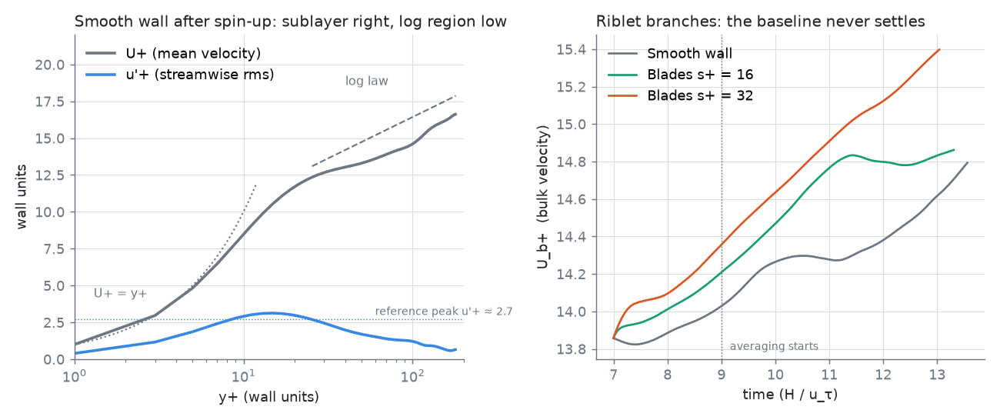
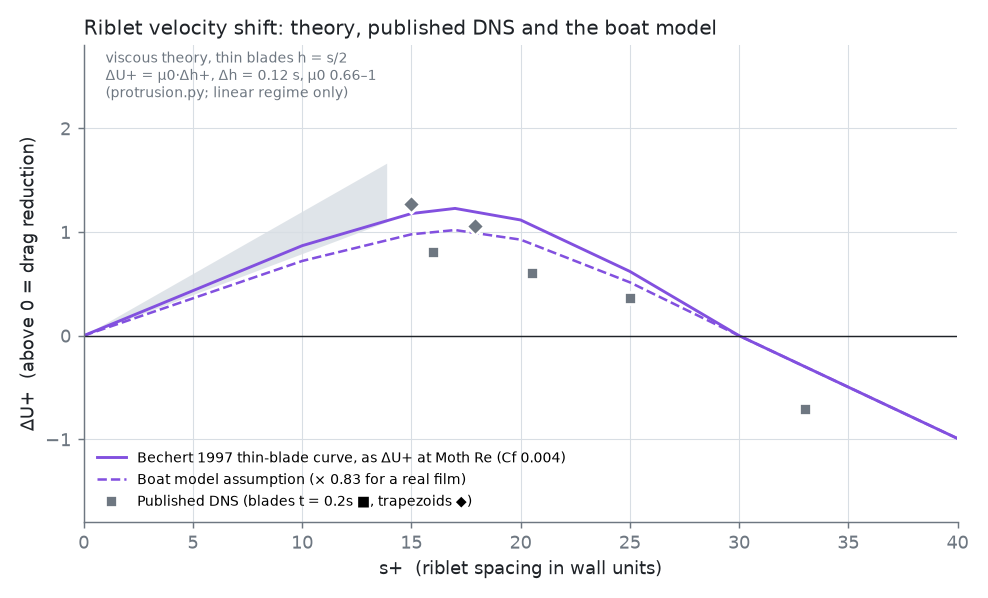
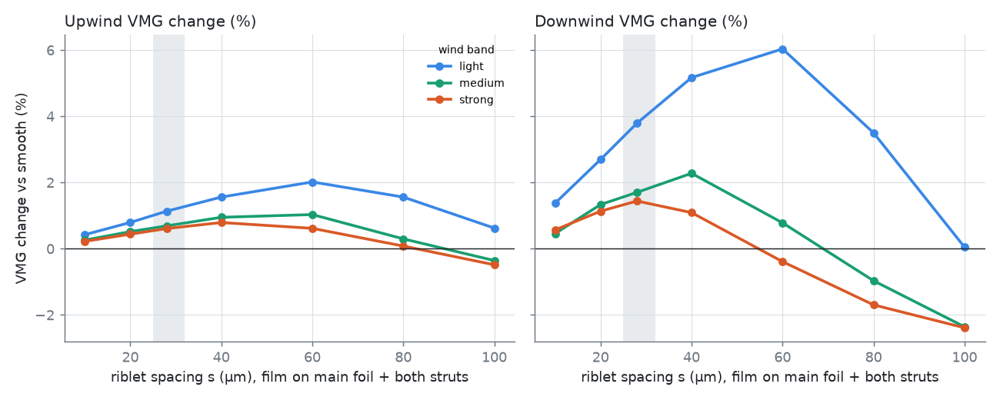

# Riblet film on Moth foils: the evidence

**Claim under test** ([SHAPE_STUDY.md](SHAPE_STUDY.md)): a riblet film with ~30 µm spacing on the turbulent part of the main foil and both struts makes a foiling Moth **about 1–2% faster in VMG**. That is roughly +0.6–1.1% upwind and +1.4–3.8% downwind, depending on the wind band.

The claim is a chain of five links. Each link is tested separately below, with the strongest independent evidence available. Four links are supported by independent evidence, and the fifth is a model result with its sensitivity shown. What is **not** proven is the on-water number. Nobody has measured riblets on a hydrofoil, and §7 describes how to do it.

**Bottom line.**
- **The physics is solid.** Riblets of the right spacing cut turbulent skin friction by 5–10%: lab data, theory reproduced here, published DNS, flight tests and water tests all agree.
- **The model is realistic at the optimum.** Its assumption (−8.2%, ΔU⁺ ≈ 1.0) sits inside the published DNS range. Past the optimum it is somewhat optimistic.
- **The whole-boat gain is a model result.** Allowing for film quality from 0.4 to 1.0 of ideal, it is **+0.3–1.3% upwind and +0.6–4.6% downwind**. It is unmeasured on the water.
- **My own turbulence simulation did not converge** at the compute available here, so it adds no evidence either way (§3).

| # | Link | Evidence | Verdict |
|---|---|---|---|
| 1 | Riblets reduce turbulent skin friction | Decades of lab, flight and water measurements (§1) | **Established** |
| 2 | The mechanism, and the best size | Viscous protrusion-height theory, re-derived here with a solver validated to ≤1.5% of published values (§2) | **Reproduced** |
| 3 | The size of the effect in a turbulent flow | Published DNS (§3); my own simulation was inconclusive (§3) | **Supported by published DNS**: ΔU⁺ ≈ +0.8 to +1.3 at the optimum, negative past s⁺ ≈ 30 |
| 4 | Conversion to Moth scale (speed, Reynolds number) | Standard ΔU⁺ → ΔC_f relation (García-Mayoral & Jiménez 2011) (§4) | **Consistent**: the model is in line with DNS at the optimum and slightly optimistic past it |
| 5 | Friction → drag → VMG | The VPP, decomposed by surface, film quality and spacing (§5) | **Model result**, with its sensitivity shown |

Reproduce everything:
- `python3 tools/riblet/protrusion.py` (about 1 min)
- `node tools/riblet/chain.mjs` (about 1 min)
- `gcc -O3 -ffast-math -fno-finite-math-only -fopenmp tools/riblet/lbm3d.c -o lbm3d -lm`, then the runs in §3 (inconclusive at this scale; see §3)
- `python3 tools/riblet/report.py docs/results/riblet docs/results/riblet/chain.json docs/figures 9`

## 1. Riblets reduce turbulent skin friction (established)

| Source | Setting | Result |
|---|---|---|
| Bechert, Bruse, Hage, van der Hoeven & Hoppe 1997, *JFM* 338:59 | Oil channel with adjustable geometry | Thin blades h = s/2: **−9.9%** friction (record). Trapezoidal grooves −8.2%. Triangular and semicircular grooves about −5% |
| García-Mayoral & Jiménez 2011, *Phil. Trans. R. Soc. A* 369:1412 | Review and theory | Best size ℓ_g⁺ = √A_g⁺ ≈ **10.7 ± 1** (s⁺ ≈ 15 for blades). Breakdown comes from spanwise Kelvin–Helmholtz rollers |
| Viswanath 2002, *Prog. Aerosp. Sci.* 38:571 | 2-D aerofoils | **−5 to −8%** skin friction at low incidence and mild adverse pressure gradient; wing-body total drag −2 to −3% |
| A320 flight test (Szodruch 1991, via Viswanath) | About 70% of the surface covered | Total drag **just under −2%** |
| Lufthansa Technik / BASF AeroSHARK, SWISS 777 fleet | Riblets of about 50 µm, >60 000 flight hours | Drag **about −1%**. Lufthansa Technik quotes 0.9% in cruise, worth 0.7–1.1% fuel |
| Benschop et al. 2018 (TU Delft); Stenzel 2011 | **In water**: Taylor–Couette rig; riblet paint | −6.2% and −5.2% |
| *Stars & Stripes*, 1987 America's Cup; US coxed four, 1984 Olympics (silver) | Hull film (3M) | Used, then **banned**. Riblets were later forbidden in official rowing. The AC75 class rule 5.10 prohibits "shark skin" and "etched riblets that are intra-boundary layer" |

**Correction to what I said in chat:** AeroSHARK's published figure is about 1% *drag*, not 1% fuel.

I found no Moth class rule restricting riblets. Check the current class rules and the sailing instructions before a major event.

## 2. Mechanism and best size: viscous theory, re-derived (reproduced)

In the viscous limit, a riblet wall looks to the streamwise flow like a flat wall h∥ below the riblet tips. To the cross-flow induced by near-wall eddies, it looks like a flat wall h⊥ below the tips. The eddies are therefore held Δh = h∥ − h⊥ further from the wall than the mean flow "sees". The log law shifts up by ΔU⁺ = μ₀·Δh⁺. The coefficient μ₀ is about 1 in Luchini's theory, and 0.66–0.79 in the fits of Jiménez and Bechert.

`tools/riblet/protrusion.py` solves both Stokes problems (Laplace for h∥, staggered-grid Stokes for h⊥) over one riblet period. Validation:

| Case | Solver h∥/s | h⊥/s | Δh/s | Reference |
|---|---|---|---|---|
| Deep thin blades (h = 2s) | 0.214 → **0.221** (extrapolated) | 0.087 | 0.128 | exact h∥ = ln 2 / π = **0.2206** |
| 60° sawtooth, h = 0.866 s | **0.1706** | **0.0789** | **0.0917** | Luchini et al. / von Deyn et al. 2022: 0.1707 / 0.0802 / 0.0905 |
| Rectangular blade, h = s/2, t = 0.2 s | 0.1126 → 0.114 | 0.0476 → 0.048 | 0.0651 → 0.066 | Luchini et al.: 0.1143 / 0.0480 / 0.0663 |
| **Thin blade, h = s/2** (the Bechert optimum) | 0.202 | 0.082 | **0.120** | not tabulated in accessible sources; consistent with the two rows above |

What this gives:
- **Drag reduction grows linearly with spacing at first.** For thin blades, ΔU⁺ ≈ (0.66–1)·0.12·s⁺, so about 0.9–1.4 at s⁺ = 12.
- **The linear growth breaks down at ℓ_g⁺ ≈ 11.** That is s⁺ ≈ 15 for blades, the optimum in every data set.
- **Beyond s⁺ ≈ 30, blade riblets increase drag** because Kelvin–Helmholtz rollers form over the grooves. Endrikat et al. 2021 found that blunt trapezoidal grooves avoid those rollers. This is why trapezoid-groove films degrade more gently than blades.

## 3. Effect size in real turbulence: published DNS supports it; my own simulation was inconclusive

`tools/riblet/lbm3d.c` is a D3Q19 lattice-Boltzmann simulation (regularised BGK, Guo forcing, a van Driest-damped Smagorinsky stabiliser, OpenMP). It uses the **minimal-span open channel** that recent riblet studies use (MacDonald et al. 2017; Endrikat et al. 2021):
- Re_τ = 180, grid spacing Δ⁺ = 2.
- Box L_x⁺ × h⁺ × L_z⁺ = 340 × 180 × 160.
- Riblet blades on the floor, a free-slip lid on top.

All cases run at the same wall friction u_τ (the total force per unit planform area is fixed). A drag reduction therefore shows up as a higher velocity above the riblets: ΔU⁺ > 0 means less drag. The three cases were branched from one turbulent smooth-wall field:

| Case | Blade geometry (cells) | s⁺ | h⁺ | t⁺ | ℓ_g⁺ | Δh⁺ (protrusion.py, same staircase) |
|---|---|---|---|---|---|---|
| Smooth | — | — | — | — | — | 0 |
| s16 | s 8, h 4, t 1 | 16 | 8 | 2 | 10.6 (≈ optimum) | 1.33 → linear-theory ΔU⁺ 0.9–1.3 |
| s32 | s 16, h 8, t 1 | 32 | 16 | 2 | 21.9 (well past breakdown) | 3.17, but viscous theory no longer applies here |

**What happened.** The in-house simulation did **not** produce a usable riblet number.
- **Three code bugs were found and fixed on the way**, each committed with a regression check:
  - float32 precision against a tiny body force;
  - an instability at τ ≈ 0.509, stabilised with a van Driest-damped Smagorinsky term. That makes the run strictly a wall-resolved LES;
  - the regularised collision was dropping part of the Guo force, so only about 52% of the driving force was applied. After the fix, the laminar open-channel solution is reproduced to 1–2%.
- **A too-weak transition trigger relaminarised,** and was replaced by a multi-mode trigger.
- **The corrected smooth-wall spin-up passes the near-wall check.** U⁺ = y⁺ in the sublayer, U⁺(9) = 7.9, and the u′⁺ peak is about 2.8–3.1 against a reference of about 2.7. The log region reads low: U⁺ ≈ 13 at y⁺ = 40, against 14.2 from the log law.
- **The riblet comparison did not converge.** At Re_τ = 180 in this minimal box, turbulence is only intermittently self-sustaining. All three runs, the smooth reference included, kept accelerating through the averaging window (figure below).
  - After 4 eddy turnovers, the lid-velocity shift is **ΔU⁺ = +0.12 ± 0.16 (s⁺ = 16) and +0.12 ± 0.17 (s⁺ = 32)**. These cannot be told from zero or from each other.
  - The riblet runs did show 20–30% lower near-wall Reynolds shear stress, which is consistent with riblet damping. On a drifting baseline, though, that is not a measurement.
  - The runs were stopped rather than letting a noisy number stand in as proof. The raw data is in `docs/results/riblet/`.
- **What a conclusive run needs** is what the published studies used: Re_τ ≥ 395, L_x⁺ ≈ 1000 and hundreds of eddy turnovers. That is roughly 50–100× the compute of the 4-core container this was run on; a GPU would do it.

**Published DNS (the evidence for this link)** (Endrikat/Modesti 2021 and Wong et al. 2024, Re_τ = 395, L_x⁺ ≈ 1000; ΔU⁺ with the sign used here):
- trapezoid s⁺ 15: **+1.27**
- trapezoid s⁺ 17.9: +1.06
- blade (t = 0.2 s) s⁺ 16: +0.81
- blade s⁺ 20.5: +0.60
- blade s⁺ 25: +0.36
- blade s⁺ 33: **−0.71** (drag increase)

These results are the evidence for link 3. They agree with the lab data (§1) and with viscous theory in the linear range (§2), and they show the drag-increasing regime past s⁺ ≈ 30 for blades.

## 4. Converting to Moth scale (consistent, model not optimistic at the optimum)

ΔU⁺ does not depend on the Reynolds number. The friction change does, through (García-Mayoral & Jiménez 2011, eq. 3.4):

  ΔC_f / C_f = −ΔU⁺ / [ (2C_f)^−½ + (2κ)^−1 ]

On a Moth foil, the turbulent part runs at Re_x ≈ 0.5–2 × 10⁶ with C_f ≈ 0.004, so the denominator is ≈ 12.4.
- A **real film at the optimum** (ΔU⁺ ≈ 0.8 for thick blades, 1.1–1.3 for trapezoids) gives **−6.5 to −10%** turbulent friction.
- The boat model uses the Bechert thin-blade curve × 0.83 = **−8.2%** at the optimum, which is ΔU⁺ ≈ 1.0. That sits inside the published range.
- Past the optimum (s⁺ 20–25) the model is **optimistic** by roughly ΔU⁺ 0.2–0.3 compared with the published blade DNS. Trapezoid films track the model better because they have no Kelvin–Helmholtz penalty.

Spacing in wall units at Moth speeds (the model's chord-averaged estimate for a 28 µm film):

| Boat speed | 8 kn | 12 kn | 16 kn | 19 kn | 23 kn | 27 kn | 31 kn |
|---|---|---|---|---|---|---|---|
| s⁺ | 5 | 7 | 9 | 11 | 13 | 15 | 17 |
| turbulent ΔC_f | −2.9% | −4.2% | −5.4% | −6.4% | −7.2% | −8.0% | −8.1% |

The chord-average estimate reads s⁺ about 15–20% lower than a local mid-chord estimate using edge velocity ([research §8.2](research/BIOINSPIRED_FOILS.md)). The model therefore slightly favours wider spacing than the true optimum.

## 5. Friction → drag → VMG (model result)

`tools/riblet/chain.mjs` puts riblets on the v2 optimised foils one surface at a time. The film is 28 µm, at 0.83 of the ideal blade curve.

| Band | Upwind VMG | Downwind VMG | Main foil only (up / down) | Struts only (up / down) | Adding the elevator too (up / down) |
|---|---|---|---|---|---|
| Light, 7 kn | +1.13% | +3.79% | +0.71 / +2.51 | +0.42 / +1.28 | +1.39 / +4.80 |
| Medium, 11 kn | +0.69% | +1.70% | +0.43 / +0.96 | +0.26 / +0.46 | +0.95 / +2.37 |
| Strong, 18 kn | +0.61% | +1.44% | +0.35 / +0.83 | +0.22 / +0.61 | +0.78 / +1.88 |

Upwind drag at 11 kn: profile drag falls 48.2 → 47.5 N and total drag 64.5 → 63.6 N (−1.4%). Speed scales roughly with drag^−½, which gives +0.7%. That matches the VPP.

**Sensitivity** (28 µm film). The film factor is the fraction of the ideal blade-riblet gain a real film achieves:

| Film factor | Light up / down | Medium up / down | Strong up / down |
|---|---|---|---|
| 0.4 | +0.54 / +1.83% | +0.34 / +0.64% | +0.26 / +0.70% |
| 0.6 | +0.79 / +2.73% | +0.52 / +1.33% | +0.44 / +1.05% |
| **0.83 (model)** | +1.13 / +3.79% | +0.69 / +1.70% | +0.61 / +1.44% |
| 1.0 (ideal blades) | +1.30 / +4.61% | +0.86 / +2.18% | +0.69 / +1.74% |

**Spacing sweep:**
- **40 µm is the best all-round choice in the model.**
- **60 µm is best in light air only.** It costs up to 0.4% in strong-air downwind.
- **80–100 µm is slower than a smooth foil** in medium and strong air.
- A local-s⁺ analysis puts the optimum lower, at 25–35 µm, for the reason given in §4.
- **Practical recommendation: 30–40 µm.** Never go above about 50 µm.

The light-air downwind figure (+3.8%) needs a caveat. The boat is sailing near the foiling threshold, where a 0.7% drag cut buys a disproportionately large speed and angle gain. It is the least certain number in the table.

## 6. What could make it wrong

- **Transition tripping.** Film on the laminar front of the section can bring transition forward, which is a net loss. Start the film aft of transition: about 40–50% chord on the suction side and 60% on the pressure side.
- **Damage to the ridge tips.** Walsh found up to **40% of the benefit lost** at a tip radius R ≈ 0.08 s, which is only 2–3 µm on a 30 µm film. Sanding, grounding and dragging the boat up a ramp all do this.
- **Fouling.** Benschop et al. 2018 found riblet coatings fouled more than smooth fouling-release coatings: over 80% cover after 6 weeks. Dry-sail and rinse the foils.
- **Yaw.** The benefit is negligible up to 15° misalignment and gone by 25–35°. Watch the swept or raked tips and the root of a strut at high leeway.
- **The film step.** A 50–100 µm film edge is a step in the surface. Feather it, and put it aft of transition.
- **Model simplifications.** The model uses chord-averaged s⁺, a single film factor, and no pressure-gradient correction. Viswanath's aerofoil data suggest the gain holds in mild adverse pressure gradient.

## 7. How to prove it on the water

The predicted effect is +0.6–1.1% upwind speed. That is below what casual testing can resolve, but not beyond it.
- **Tow or bench test of one strut (cleanest).** Tow a strut on a load cell at 5–10 m/s, then repeat with the film on the aft 60% of the chord. The predicted strut drag change is −2 to −4%, which a repeatable tow rig can resolve.
- **Two-boat testing.** Two boats sail side by side on the same heading. Swap the treated foils between boats every run to cancel boat and sailor differences.
- **Single-boat A/B testing with a logger.** Log GPS Doppler speed, heel, heading and wind. Compare 2–3 minute upwind legs, alternating the foils. Suppose leg-to-leg scatter in upwind speed is about 2%. Getting the difference to ±1% at 95% confidence then needs about 30 paired legs, or about 60 for an 80% chance of detecting a true 1% gain. A good logger (Doppler speed ±0.05 m/s) makes each leg worth more.

## Sources

Verified in September 2026. The URLs are listed in [research/BIOINSPIRED_FOILS.md](research/BIOINSPIRED_FOILS.md) §8, plus:
- Luchini et al. (JFM 2026, arXiv 2506.22239), Table 1: protrusion heights.
- von Deyn, Gatti & Frohnapfel 2022, *JFM* 951 A16.
- Endrikat, Modesti et al. 2021, *JFM* 917 and 913; Wong et al. 2024, *JFM* (doi 10.1017/jfm.2023.1006).
- MacDonald et al. 2017, *JFM* 816: minimal-span channel (arXiv 1703.00950).
- Benschop et al. 2018, TU Delft: riblets with fouling-release properties.
- Kuntzagk 2024, AeroSHARK lecture (HAW Hamburg / DGLR); Lufthansa Technik press release on the AeroSHARK SWISS 777 fleet roll-out.
- AC75 Class Rule v3.01, rule 5.10.
