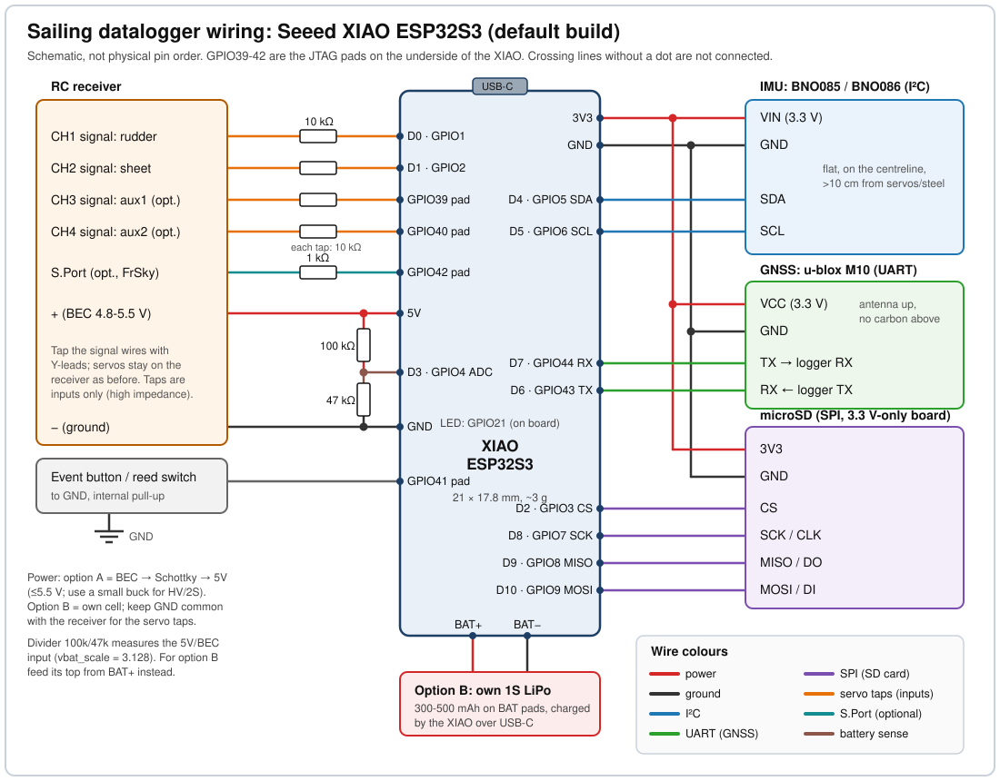

# On-board sailing datalogger

A small logger for a 1 m radio yacht (IOM, about 4 kg, cramped and wet hull) and for a full-size foiling Moth. It records attitude, GNSS speed and track, the receiver's rudder and sheet commands and the supply voltage at 50 Hz, as `sail-log v1` CSV files on a microSD card.

- **Log format (binding contract):** [`docs/LOG_FORMAT.md`](../../docs/LOG_FORMAT.md). The firmware follows it exactly: column order, units, sign conventions and metadata keys.
- **Analysis:** load the `LOGnnnn.CSV` files into the analysis page, `analysis.html`, at the repository root (built separately against the same spec).

| | |
|---|---|
| MCU | ESP32-S3: Seeed Studio XIAO ESP32S3 (default) or ESP32-S3-DevKitC-1 |
| IMU | CEVA BNO085/BNO086, on-chip fusion (rotation vector, calibrated gyro, accelerometer) at 100 Hz over I²C |
| GNSS | u-blox M10 (MAX-M10S, BE-880Q-class, FPV M10 modules), UBX NAV-PVT at 10 Hz (up to 25 Hz), dynamic model "sea" |
| Servo inputs | 2 to 4 receiver channels, tapped passively, 1 µs timestamps |
| Storage | microSD over SPI, one file per power-on, ring-buffered block writes |
| Extras | supply voltage, event button or transmitter switch, status LED, optional FrSky S.Port telemetry |
| Mass | about 21 g without battery (IOM build), see the [bill of materials](#bill-of-materials) |

Contents: [Quick start](#quick-start) · [Bill of materials](#bill-of-materials) · [Wiring](#wiring) · [Power](#power) · [Installation](#installation) · [Calibration](#calibration) · [Operation](#operation) · [Config reference](#configtxt-reference) · [Telemetry](#telemetry-frsky-sport) · [Firmware](#firmware) · [Limitations](#limitations)

---

## Quick start

1. Build and flash (see [Firmware](#firmware)): `pio run -d hardware/logger -t upload`.
2. Format a microSD card as FAT32 (32 GB or smaller), insert it and power up. The logger writes a default `/config.txt` if the card has none. Edit it on a computer (boat name, class, channels, calibration), or start from [`config.example.txt`](config.example.txt).
3. Watch the LED: a double flash every 2 s means it is logging and waiting for a GNSS fix; a single flash means it is logging with a fix.
4. Short-press the button (or flick the event switch) to mark a test leg. Hold it 2 to 6 s with the hull level to capture the level offset.
5. Power off, take the card out and load `LOGnnnn.CSV` into `analysis.html`.

---

## Bill of materials

Prices are approximate UK retail in GBP (September 2026) and masses are for the bare boards. Equivalent parts work if the voltages and interfaces match.

| # | Part | Example part numbers | Approx. £ | Mass |
|---|---|---|---:|---:|
| 1 | MCU board with 1S LiPo charger | Seeed Studio **XIAO ESP32S3** (not the Sense version) | 7 | 3 g |
| 2 | IMU with sensor fusion | **Adafruit 4754** BNO085 breakout, or SparkFun **SEN-22857** (BNO086, Qwiic) | 22 to 30 | 2 to 3 g |
| 3a | GNSS, IOM (small) | u-blox M10 FPV module with a 15 to 18 mm patch, e.g. **HGLRC M100 Mini** or **Matek M10Q-5883** (its compass is not used) | 15 to 25 | 3 to 7 g |
| 3b | GNSS, Moth (better antenna) | **Beitian BE-880Q** (M10, 25 mm patch), or SparkFun **GPS-18037** MAX-M10S breakout plus a patch antenna | 15 to 45 | 8 to 12 g |
| 4 | microSD socket, 3.3 V only (no 5 V regulator or level shifter) | **Adafruit 4682** | 3.50 | 1.5 g |
| 5 | microSD card, high endurance, 8 to 32 GB | SanDisk High Endurance, Kingston High Endurance | 8 | 0.3 g |
| 6 | Resistors (0603/0805 or 1/8 W) | 4 × 10 kΩ (servo taps), 1 × 1 kΩ (S.Port), 100 kΩ + 47 kΩ (supply divider) | 0.50 | 0.3 g |
| 7 | Event switch | Glass reed switch and a 5 mm magnet (works through a sealed bag or hull), or a sealed tactile switch | 2 | 0.5 g |
| 8 | Leads | 2 to 4 servo Y-leads, 30 AWG silicone wire, JST-SH/ZH plugs | 4 | 5 g |
| 9 | Protection | Conformal coating (e.g. MG Chemicals 422C), heat-shrink, heat-sealed or vacuum bag, or a small IP67 box for the Moth | 5 | 2 to 10 g |
| 10 | *Optional:* own battery | 1S LiPo 300 to 500 mAh (e.g. 502535, 400 mAh) | 5 | 8 to 10 g |
| 11 | *Optional:* regulator for a BEC above 5.5 V (HV or 2S LiFe) | Pololu **D36V6F5** (5 V) or D36V6F3 (3.3 V into the 3V3 pin) | 6 | 0.5 g |
| 12 | *Optional:* Schottky diode in the BEC feed | BAT54, SS14 | 0.20 | 0.1 g |

**IOM build total (items 1, 2, 3a, 4 to 9):** about **£70** and about **21 g** (3 + 3 + 4 + 1.5 + 0.3 + 0.3 + 0.5 + 5 + 3) without a battery, which meets the 25 g target. A 400 mAh cell adds about 9 g. The Moth build with a BE-880Q and an IP67 box is about £80 and 40 to 60 g, where mass hardly matters.

---

## Wiring



The diagram is schematic; see Seeed's XIAO ESP32S3 pinout for the physical pad positions. GPIO39 to GPIO42 are the four JTAG test pads on the underside of the XIAO. If you cannot solder to them, you lose aux1, aux2, the button and S.Port: use a transmitter switch on the sheet channel for events instead, or use the DevKitC build, which has plenty of pins.

### XIAO ESP32S3 (env `xiao_esp32s3`, default)

| Function | XIAO pin | GPIO | Connects to | Notes |
|---|---|---:|---|---|
| I²C SDA | D4 | 5 | BNO085 SDA | 400 kHz; breakouts have pull-ups |
| I²C SCL | D5 | 6 | BNO085 SCL | |
| GNSS RX | D7 | 44 | GNSS TX | UART1 |
| GNSS TX | D6 | 43 | GNSS RX | UART1, used to configure the module |
| SD CS | D2 | 3 | microSD CS | |
| SD SCK | D8 | 7 | microSD CLK | SPI, 20 MHz |
| SD MISO | D9 | 8 | microSD DO | |
| SD MOSI | D10 | 9 | microSD DI | |
| Rudder in | D0 | 1 | Receiver rudder signal via 10 kΩ | Passive tap |
| Sheet in | D1 | 2 | Receiver sheet (sail winch) signal via 10 kΩ | Passive tap |
| Aux1 in | pad MTCK | 39 | Receiver channel via 10 kΩ | Optional |
| Aux2 in | pad MTDO | 40 | Receiver channel via 10 kΩ | Optional; can be the event switch channel |
| Supply sense | D3 | 4 | Divider midpoint: 100 kΩ to the supply, 47 kΩ to GND | ADC1_CH3, `vbat_scale = 3.128` |
| Event button | pad MTDI | 41 | Button or reed switch to GND | Internal pull-up |
| S.Port | pad MTMS | 42 | Receiver S.Port signal via 1 kΩ | Optional |
| Status LED | on board | 21 | | Active low |
| 3V3 | 3V3 | | BNO085 VIN, GNSS VCC, microSD 3V3 | About 80 mA total |
| 5V | 5V | | Receiver BEC + (option A) | ≤ 5.5 V; Schottky diode recommended |
| GND | GND | | Everything, **including receiver −** | Common ground is required for the taps |
| BAT+/BAT− | underside pads | | 1S LiPo (option B) | Charged over USB-C |

### ESP32-S3-DevKitC-1 (env `devkitc`)

SDA 8, SCL 9, GNSS RX 18 / TX 17, SD SCK 12 / MISO 13 / MOSI 11 / CS 10, rudder 4, sheet 5, aux1 6, aux2 7, supply sense 1, event = BOOT button (GPIO0), S.Port 16, RGB LED 48 (GPIO38 on board revision 1.1: change `PIN_LED` in `platformio.ini`).

### Servo taps are passive

- Each tap is a **10 kΩ series resistor into a GPIO that is only ever an input**. The firmware does not enable a pull-up or pull-down on these pins and never drives them. The receiver still drives the servo directly, exactly as before.
- The load on the signal line is about 10 kΩ plus a few pF, far below what a servo input can notice. With the logger unpowered, the resistor limits any current through the ESP32's protection diodes to well under 1 mA, so a dead or unplugged logger cannot pull the line or stop the steering.
- The logger ground **must** be common with the receiver ground: the pulse is measured against it.
- If your receiver outputs 5 V pulses rather than 3.3 V, add a 20 kΩ resistor from the GPIO to GND (with the 10 kΩ this makes a 2:3 divider, still high impedance).
- Wire the taps with servo Y-leads so the logger can be unplugged and the boat is back to standard.

---

## Power

**Option A: receiver BEC or receiver pack (IOM).** Feed the receiver's + (4.8 to 5.5 V) into the XIAO **5V** pin through a Schottky diode (BAT54 or SS14). The diode stops USB power back-feeding the receiver and servos when you plug in a cable. For HV BECs, 2S LiFe or 2S LiPo packs, use a small buck regulator (Pololu D36V6F5) first: do not put more than 5.5 V on the 5V pin.

**Option B: own 1S LiPo (Moth, or to keep the IOM receiver pack untouched).** Solder a 300 to 500 mAh cell to the BAT+/BAT− pads on the underside of the XIAO; it charges from USB-C. Keep the receiver ground connected when tapping servos. Move the top of the divider to BAT+ so `vbat` shows the cell voltage (`vbat_scale` is unchanged).

**Current budget (3.3 V rail, CPU at 80 MHz, radios off):**

| Load | Typical |
|---|---:|
| ESP32-S3 at 80 MHz, WiFi and BT off | 22 to 30 mA |
| BNO085, three reports at 100 Hz, magnetometer on | 10 to 13 mA |
| u-blox M10 tracking at 10 Hz (module with LNA) | 12 to 25 mA |
| microSD, averaged (bursts of 50 to 100 mA while writing) | 5 to 15 mA |
| LED, regulator and dividers | about 2 mA |
| **Total** | **about 55 to 85 mA; plan for 90 mA** |

**Runtime:** a 400 mAh 1S LiPo lasts about 4 h (using 80 % of its capacity). On an IOM receiver pack of 2000 mAh, the logger uses about 0.45 Ah over a 5 h race day, on top of the servos: check your margin. Set `vbat_stop` so the file is closed cleanly before the supply collapses.

---

## Installation

### IOM (International One Metre)

- **Position:** near the boat's centre of gravity (by the fin box and mast step) and low in the hull, on the centreline. Glue a thin plywood or G10 plate to the hull or a bulkhead and fix the logger to it with double-sided foam tape so it cannot shift. Keep the **IMU at least 10 to 15 cm from the rudder servo, the sail winch and any steel** (fin bolts, keel box fasteners, magnetic stainless screws): see [Calibration](#calibration).
- **Waterproofing:** the hull is wet. Conformal-coat all boards, masking the microSD socket, USB-C, the button and connectors. Then heat-seal or vacuum-seal the assembly in a thin polythene bag, with the leads leaving through one sealed edge, or pot the lead exit with a drop of silicone. A reed switch and magnet work through the bag, so the bag never needs a hole for the button. Pack a silica-gel sachet.
- **GNSS antenna:** patch facing up, as high as possible, directly under a **non-carbon** part of the deck. Carbon and foil-covered decks block GNSS signals, so fit a small glass-cloth, Mylar or clear-film window, or place the antenna under a non-carbon hatch cover. The GNSS module can sit on 10 to 15 cm leads under the deck while the IMU stays low near the CG.
- **Mass and trim:** the logger (about 21 g, or about 30 g with its own cell) is part of the boat at measurement. If the boat carries corrector weights, remove the same mass of corrector so the total stays at the class minimum, and put the logger close to where that corrector sat so fore-and-aft trim does not change.
- **Class and event rules:** the logger is passive. It controls nothing, sends nothing to the steering, and the servo taps cannot affect the rudder or sail signals. Even so, **check the current IOM Class Rules, the Racing Rules of Sailing Appendix E (radio sailing) and the notice of race or sailing instructions** before racing with it. Rules on additional electronic equipment, on data transmission from the boat and on what may be fitted at measurement change over time, and event rules can be stricter. In particular, S.Port telemetry of anything other than battery voltage or signal strength may not be allowed while racing: set `sport_enable = 0` for events. Use the logger freely for tuning and two-boat testing.

### Moth

- Mount on the **boat centreline**, rigidly (vibration from foiling otherwise shows up in the accelerometer and gyro), close to the CG: for example on the deck just aft of the mainfoil case, or on the centreboard-case top inside the cockpit.
- Use a **waterproof case** (IP67 ABS box or a micro hard case), with the lid **not** carbon or metal, so the GNSS has a clear **sky view**. It should not be under the wing bar, the boom or the helm's body in normal sailing. On foiling Moths, a deck-top position aft of the mast works well.
- Use power option B (own 1S cell). No receiver is involved: set `channels = none`, or use `aux1`/`aux2` for a PWM-output sensor if you have one.
- Carbon hulls have few magnetic parts, but keep the IMU away from stainless steel fittings, trapeze or hiking hardware and any electronics.

---

## Calibration

Work through these in order after installation. The USB console (115200 baud, `pio device monitor`) helps: `status` prints everything once, and `raw` prints the sensor-frame accelerometer.

### 1. Mounting axes (`imu_mount`)

`imu_mount` tells the firmware how the IMU's own x, y and z axes lie in the boat: `x_<dir>_y_<dir>_z_<dir>` with `<dir>` one of `fwd`, `aft`, `stbd`, `port`, `down`, `up`. The default `x_fwd_y_port_z_up` is a BNO085 breakout lying flat, component side up, with its x arrow pointing to the bow.

To find the mapping without markings:

1. Stand the hull upright and level and send `raw`. The axis that reads about **+9.8** points **up**; −9.8 means that axis points down.
2. Lower the bow about 45° and send `raw` again. The axis that has become strongly **negative** (about −7) points **forward**; strongly positive means it points aft.
3. The third axis follows from the right-hand rule. The firmware rejects left-handed combinations and reports `invalid` for that line at boot.
4. Check with `status`: heel to starboard gives **roll +**, bow up gives **pitch +**, and turning the bow clockwise (seen from above) increases **yaw**.

If the board is square to the hull but rotated a few degrees in yaw, set `yaw_trim_deg` (it is added to the heading and rotates the gyro and accelerometer axes to match).

### 2. Level offset

The board is never glued exactly level. With the hull at its designed flotation attitude (on a levelled stand, or afloat in flat calm), **hold the button for 2 to 6 s** (the LED turns solid in that window; release while it is solid), or send `level`. The logger averages 0.5 s of attitude, stores the tilt in `/level.txt` on the card and removes it from roll, pitch, gyro and accelerometer from then on. It is also written to the file header as `level_roll_deg`/`level_pitch_deg`. `level_at_boot = 1` captures automatically 3 s after power-on, but only use that if the boat is always level at switch-on.

### 3. Magnetometer (heading)

The BNO08x calibrates itself continuously; you only help it converge and save the result.

1. Assemble the boat completely: rig, bulb, servos, battery. Hard-iron offsets from parts that move with the hull are then calibrated out.
2. Take it **away from steel**: no cars, workbench vices, concrete rebar or the pontoon's steel frame within a couple of metres.
3. Send `magcal`, then slowly rotate the whole boat through all orientations (figures of eight, rolls to both sides, bow up and down) for about a minute, with the receiver and servos powered.
4. `status` should show `mag_status 3` and `hdg_acc` falling to a few degrees. Then send `savecal` to store the calibration in the sensor.

**Why yaw is noisy in an IOM:** the magnetometer sits centimetres from the servos. Servo motors contain strong permanent magnets and draw pulsed currents of up to several amps. The sail winch's magnet turns with the drum, so its field at the IMU changes with every sheet movement. Fin and keel-box bolts are often steel. Lead is not magnetic, but its steel fixings are. Calibration only removes fields that are fixed relative to the sensor, not ones that move or switch. Expect heading errors of a few degrees in a good installation and 10 to 20° near the winch. Use COG from the GNSS for course and treat yaw as a short-term, relative signal. If yaw is useless in your boat, set `imu_fusion = game`: roll and pitch then ignore the magnetometer and the yaw column stays empty.

Set `declination_deg` (east positive, west negative; look up your venue with NOAA's or BGS's declination calculator) to log true heading. The header then carries `declination_deg` and `yaw_ref=true`.

### 4. Servo pulses

With the transmitter on and `status` running:

1. **Rudder centre:** trim the rudder dead straight and note `rudder` in µs, then set `rudder_center_us`.
2. **Rudder gain:** put the rudder at a known angle with the trailing edge **to port** (the helm command that bears the bow to starboard). Measure the angle with a protractor template on the rudder stock and note the pulse. `rudder_deg_per_us = angle / (pulse − centre)`. The sign matters: it is positive if the pulse *increases* for trailing edge to port, negative otherwise.
3. **Sheet:** stick fully in (sails sheeted hard in), note `sheet` and set `sheet_in_us`; stick fully out, set `sheet_out_us`.
4. **Aux channels:** name them with `aux1_name`/`aux2_name` (e.g. `jib`, `flap`). For an event switch on a spare channel set `event_channel = aux2` and a threshold between the switch positions.

These values only go into the file header. The raw pulse widths are always logged, so a later recalibration can be applied in analysis.

---

## Operation

### Status LED

| Pattern (2 s cycle) | Meaning |
|---|---|
| Solid on | Booting (configuring GNSS, mounting the card) |
| Fast blink, 5 Hz | **No SD card or card error: nothing is being logged.** The logger retries every 5 s |
| 1 short flash | Logging, GNSS 2-D or 3-D fix |
| 2 short flashes | Logging, no GNSS fix yet |
| 3 short flashes | Logging, but the **IMU is not answering** (attitude columns empty) |
| Slow blink, 1 s on / 1 s off | Stopped: file closed by a very long press or low supply |
| Solid while the button is held 2 to 6 s | Release now to capture the level offset |
| Dark while the button is held ≥ 6 s | Release now to close the file (or open a new one) |
| Brief solid flash | Event marked (0.3 s) or level captured (1.5 s) |

The DevKitC's RGB LED uses colour as well: green for logging with a fix, amber for no fix, magenta for an IMU fault, red for an SD fault.

### Button and events

| Press | Action |
|---|---|
| Short, under 1 s | Event marker: the next row gets `event` = 1, then 2, 3, … (all other rows are 0) |
| 2 to 6 s | Capture the level offset |
| 6 s or longer | Close the current file with its trailer, or start a new file if stopped |

A transmitter switch on a spare channel (`event_channel`) also creates events, each time it moves past `event_threshold_us`. Use it to tag A/B legs without touching the boat.

### USB console

`status`, `raw`, `level`, `event`, `stop`, `start`, `magcal`, `savecal` (115200 baud; the XIAO uses native USB).

### Files on the card

| File | Content |
|---|---|
| `LOG0001.CSV`, `LOG0002.CSV`, … | One per power-on (and per stop/start), numbered one above the highest on the card |
| `config.txt` | Your settings; written with defaults if missing |
| `level.txt` | Level offset from the last capture |

About 170 bytes per row, so 50 Hz is about 30 MB per hour. A 16 GB card holds hundreds of hours. Use FAT32; exFAT is not supported.

The file layout follows [`docs/LOG_FORMAT.md`](../../docs/LOG_FORMAT.md): `# key=value` metadata, the column header, then rows at `rate_hz`. Beyond the spec's keys the header adds `board`, `file`, `imu_fusion`, `yaw_ref` (`magnetic`, `true` or `none`), `yaw_trim_deg`, `level_roll_deg`, `level_pitch_deg` and `gnss_rate_hz`; readers ignore unknown keys. `start_utc` is in the header only if a fix existed when the file was opened, which is usually not the case at power-on.

**Trailer:** the file always ends with a `#` trailer that is rewritten after every block of data:

```
# start_utc=2026-09-24T10:15:02Z
# rows=183250
# dropped_rows=0
# end_t_ms=3665020
```

`start_utc` is the UTC of the first GNSS fix (the line appears once it is known), `dropped_rows` counts rows that could not be buffered (0 in normal use), and `level_captures` appears if the level was re-captured while the file was open. Because the trailer is rewritten in place after each block, a file cut short by a power loss still ends with a trailer describing everything before the last block. The last data row can be incomplete after a power cut, and readers should drop a partial final line.

### Getting the logs off

Power off, open the bag or box, take out the microSD card and copy the `LOG*.CSV` files with any card reader. Open `analysis.html` from the repository and load the files. Future options: USB mass-storage mode (the ESP32-S3 supports it) or WiFi download on the pontoon.

---

## config.txt reference

`key = value`, one per line; lines starting with `#` are comments; unknown keys and bad values are reported on the console and ignored (the default is kept). A value of `none` or an empty value clears optional settings.

| Key | Default | Range / values | Meaning |
|---|---|---|---|
| `boat` | `unnamed` | text, max 47 chars | Header `boat` |
| `class` | `IOM` | `IOM`, `Moth`, `other` | Header `class`, selects defaults in the analysis page |
| `rate_hz` | `50` | 10, 20, 25, 40, 50, 100 | Data-row rate (must divide 1000) |
| `fsync_s` | `5` | 1 to 60 | Seconds between fsyncs (the maximum data lost on a power cut) |
| `imu_mount` | `x_fwd_y_port_z_up` | see [Calibration](#1-mounting-axes-imu_mount) | Sensor-to-body axis mapping; written to the header |
| `imu_fusion` | `rv` | `rv`, `game` | `rv`: magnetometer-referenced heading. `game`: no magnetometer, empty `yaw` column |
| `yaw_trim_deg` | `0` | −180 to 180 | Added to heading (sensor not quite fore-and-aft) |
| `declination_deg` | *(empty)* | −90 to 90, east + | If set, `yaw` is true heading and the header carries `declination_deg` |
| `level_at_boot` | `0` | 0/1 | Capture the level offset 3 s after power-on |
| `gnss_rate` | `10` | 1 to 25 Hz | NAV-PVT rate. Above 10 Hz BeiDou and GLONASS are switched off, above 18 Hz Galileo too |
| `gnss_baud` | `115200` | standard rates | UART speed the module is switched to |
| `gnss_latency_ms` | `40` | 0 to 500 | Assumed delay from GNSS epoch to message arrival, used to map `t_ms` to `utc_ms` |
| `channels` | `rudder,sheet` | any of `rudder,sheet,aux1,aux2`, or `none` | Receiver channels wired; others log empty |
| `rudder_center_us` | `1500` | 500 to 2500 | Header: rudder pulse at 0° |
| `rudder_deg_per_us` | `0.09` | −1 to 1, not 0 | Header: + = trailing edge to port |
| `sheet_in_us`, `sheet_out_us` | `1100`, `1900` | 500 to 2500 | Header: pulse at sheet fully in / out |
| `aux1_name`, `aux2_name` | `aux1`, `aux2` | text | Header names (written if the channel is enabled) |
| `pulse_min_us`, `pulse_max_us` | `800`, `2200` | | Pulses outside this range are glitches and are rejected |
| `event_channel` | `none` | `none`, `aux1`, `aux2` | Transmitter switch that creates events |
| `event_threshold_us` | `1700` | 900 to 2100 | Switch threshold (100 µs hysteresis) |
| `vbat_scale` | `3.128` | 0.5 to 20 | Divider ratio: (100 k + 47 k) / 47 k |
| `vbat_stop` | `0` | V, 0 = off | Close the file cleanly if the supply stays below this for 2 s |
| `sport_enable` | `0` | 0/1 | FrSky S.Port telemetry |
| `sport_id` | `12` | 0 to 27 | S.Port physical ID (0-based; 12 = byte 0xAC) |
| `vmg_bearing_deg` | *(empty)* | 0 to 360 true | Bearing for the telemetry "VMG" value (speed made good towards it) |

---

## Telemetry (FrSky S.Port)

With `sport_enable = 1` the logger answers S.Port polls for `sport_id` as a sensor hub, so an EdgeTX or ETHOS transmitter can display and log the values. Wire the receiver's S.Port signal to GPIO42 through 1 kΩ (common ground). The line is inverted 57600 8N1, half duplex; the firmware drives the pin only while it answers.

| Value | App ID | Encoding | Transmitter setup |
|---|---|---|---|
| SOG | 0x0830 (GPS speed) | knots × 1000 | Discovered as GPS speed, knots |
| COG | 0x0840 (GPS course) | deg × 100 | Discovered as heading |
| Position | 0x0800 (GPS lat/lon) | standard | Shows in the GPS sensor |
| Supply | 0x0210 (VFAS) | V × 100 | Volts |
| Heel (roll) | 0x5100 (DIY) | deg × 10, signed | Custom sensor, 1 decimal |
| VMG | 0x5101 (DIY) | knots × 100, signed | Custom sensor, 2 decimals; only if `vmg_bearing_deg` is set |
| Heading (yaw) | 0x5102 (DIY) | deg × 10 | Custom sensor, 1 decimal |
| Pitch | 0x5103 (DIY) | deg × 10, signed | Custom sensor, 1 decimal |

There is no wind sensor, so "VMG" is only the speed made good towards a fixed bearing (the windward mark or the wind axis you set), which is useful for spotting gains on a beat.

Compile the S.Port code out with `-DSAILLOG_SPORT=0`. **Future alternative:** CRSF telemetry for ExpressLRS/TBS receivers (a 420 kbaud UART link, with GPS, attitude and battery frames that EdgeTX already understands) would replace S.Port on non-FrSky systems. The pure-logic split used here (`saillog_sport.*`) is the pattern to follow.

Class-rule caution again: transmitting data from the boat while racing is restricted (see [Installation](#iom-international-one-metre)).

---

## Firmware

```
hardware/logger/
├── platformio.ini          envs: xiao_esp32s3 (default), devkitc
├── config.example.txt      = the default config.txt (a host test keeps them identical)
├── wiring.svg
├── src/                    Arduino/ESP32 glue (tasks, drivers)
│   ├── main.cpp            setup, sampler task, button, LED, supply, console
│   ├── imu.cpp             BNO08x over I²C, own SH-2 callback (no lost reports)
│   ├── gnss.cpp            UART, UBX config/ACK, NAV-PVT, UTC clock
│   ├── servo.cpp           CHANGE interrupts → width queue → decoder
│   ├── sd_logger.cpp       config/level files, LOGnnnn.CSV, writer task, trailer
│   ├── sport.cpp           S.Port responder (optional)
│   ├── app.h, board.h      shared state, pin map
├── lib/saillog/src/        pure C++ logic, no Arduino: unit tested on the host
│   ├── saillog_csv.*       header, rows, trailer, file names (exact spec format)
│   ├── saillog_attitude.*  quaternion → yaw/roll/pitch, mount, level, declination
│   ├── saillog_pulse.*     edge timing, pulse validation/median/timeout, switch events
│   ├── saillog_ubx.*       UBX checksum, parser, NAV-PVT, CFG-VALSET builders
│   ├── saillog_sport.*     S.Port CRC, stuffing, physical IDs, poll detect, scheduler
│   ├── saillog_config.*    config.txt parser, defaults, imu_mount parser
│   ├── saillog_util.*      button, LED patterns, GNSS-disciplined UTC clock, vbat filter
│   ├── saillog_ringbuf.h   lock-free SPSC byte ring and record queue
│   └── saillog_fmt.*       allocation-free number/date formatting
└── test_host/              host unit tests (g++), Makefile
```

**Build:**

```sh
pip install platformio
pio run -d hardware/logger                 # XIAO ESP32S3
pio run -d hardware/logger -e devkitc      # ESP32-S3-DevKitC-1
pio run -d hardware/logger -t upload       # flash (hold BOOT while plugging in if needed)
pio device monitor -d hardware/logger      # console
```

**Host tests:**

```sh
make -C hardware/logger/test_host          # build and run
make -C hardware/logger/test_host asan     # same under AddressSanitizer/UBSan
```

**Timing design:** the sampler task (highest priority on core 1) wakes on an exact `rate_hz` schedule with `vTaskDelayUntil`. It snapshots the latest IMU, GNSS and servo state, formats one row and pushes it into a 64 KB lock-free ring buffer (about 7 s at 50 Hz). It never touches the SD card. The SD writer task on core 0 writes 8 to 16 KB blocks, or whatever is queued once a second, followed by the trailer, and fsyncs every `fsync_s` seconds. An SD card that stalls for several hundred ms (normal for flash housekeeping) only fills the ring. Rows are dropped only if the ring overflows, and they are counted in `dropped_rows`. The IMU reports at 100 Hz and GNSS at 10 Hz; each row carries the most recent sample, and `gnss_new` = 1 marks the row where a new NAV-PVT arrived. `utc_ms` is the row's `t_ms` mapped through a clock disciplined by NAV-PVT time (slewed by at most 2 ms per fix, so it stays monotonic).

**Attitude conventions:** the BNO08x quaternion maps sensor axes into East-North-Up. The firmware converts it to NED, applies `imu_mount`, `yaw_trim_deg` and the level offset, and extracts ZYX Euler angles: roll + = starboard down, pitch + = bow up, yaw clockwise from north, all in the body frame x forward, y starboard, z down. Gyro rates and accelerations are rotated into the same body frame. The accelerometer is reported as measured (specific force, gravity included), so a level hull at rest reads `az ≈ −9.81`, and a hull heeled to starboard at rest reads a *negative* `ay` (≈ −9.81·sin roll).

---

## Limitations

- **Heading:** see [magnetometer calibration](#3-magnetometer-heading). Near servos, winches and steel, magnetic heading errors of 5 to 20° are normal in an IOM, and they change as the servos move. Leeway (heading minus COG) is only meaningful after a careful calibration in a clean installation. Roll and pitch are unaffected, or use `imu_fusion = game` to remove the magnetometer from them entirely.
- **GNSS speed vs position:** `sog` is Doppler speed, good to a few cm/s (`sacc` is logged row by row). Position (`hacc`) is only good to 1 to 3 m, so never differentiate positions for speed or acceleration at IOM speeds (0.5 to 1.5 m/s). An antenna under a deck, heeled and close to the water loses satellites and accuracy. Watch `sats` and `hacc`.
- **Time:** `utc_ms` for rows between fixes is interpolated from `t_ms`, and the GNSS output latency is an estimate (`gnss_latency_ms`). Expect ±20 ms absolute UTC accuracy, with relative timing within a file far better.
- **No true wind:** there is no anemometer, so `tws`/`twd` are empty and `tws_source=none`. Telemetry "VMG" is speed made good towards a configured bearing, not true VMG.
- **Servo channels are commands, not positions:** a winch that stalls under load, or a rudder servo that lags, is not visible. Receivers in failsafe keep sending their failsafe pulses, which are logged as such.
- **Accelerations include gravity and are body-frame:** heel and pitch put gravity components into `ax`/`ay`.
- **Power loss:** up to `fsync_s` seconds, plus the partial last row, can be lost if the supply is cut while logging. Use `vbat_stop`, or a very long press, for a clean close.
- **BNO08x over I²C:** the ESP32's I²C and the BNO08x's clock stretching occasionally disagree. The firmware re-enables reports after a sensor reset (counted in `status`). If resets are frequent, shorten the I²C wires; SPI mode is a possible future change.
- **Not tested on hardware in this repository:** the firmware builds for both targets and the logic is unit tested on the host, but pin choices (especially the XIAO underside pads), M10 behaviour above 10 Hz and S.Port timing on your receiver should be bench-checked before relying on them.
